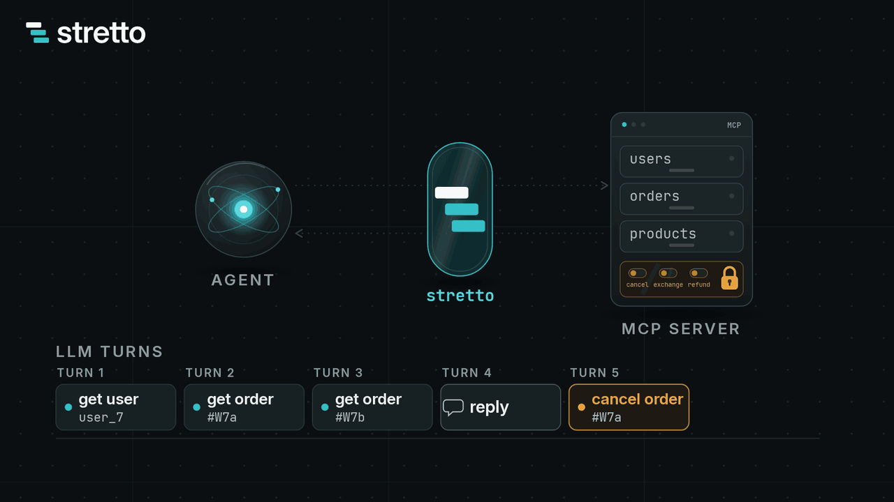
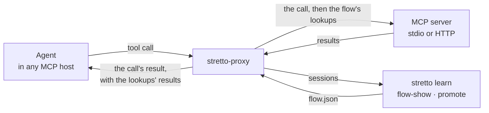
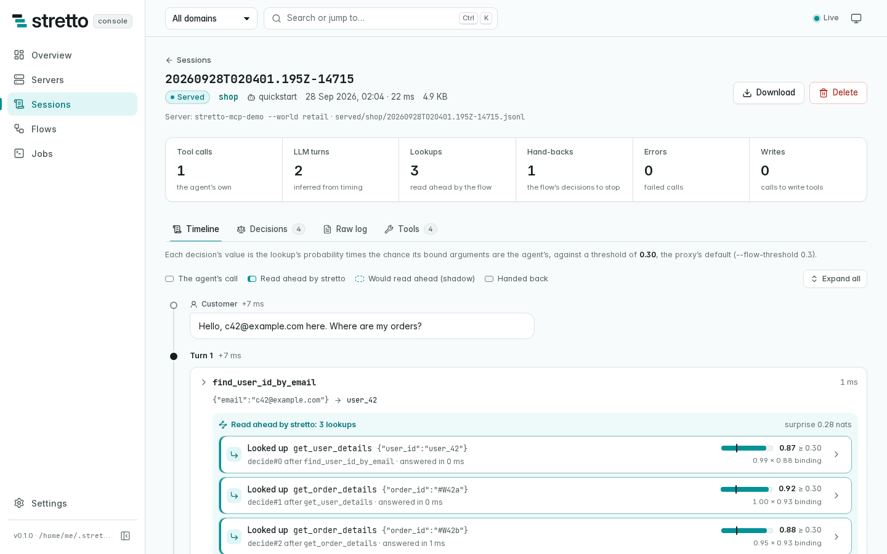

<p align="center">
  <a href="https://stretto.alexnodeland.com/">
    <picture>
      <source media="(prefers-color-scheme: dark)" srcset="brand/logo/stretto-lockup-dark.svg">
      
    </picture>
  </a>
</p>

<p align="center"><strong>Read ahead of your agent.</strong></p>

<p align="center">
  <a href="https://github.com/alexnodeland/stretto/actions/workflows/ci.yml"></a>
  <a href="https://stretto.alexnodeland.com/"></a>
  <a href="paper/stretto.md"></a>
  <a href="LICENSE"></a>
</p>

stretto learns, from your agent's recorded tool calls, which reads it makes next and where their arguments come from, and serves them through an MCP proxy in the same tool result, so the agent needs fewer LLM turns.

<p align="center">
  <a href="https://stretto.alexnodeland.com/"></a>
  <br>
  <sub><a href="https://stretto.alexnodeland.com/">The explainer video</a> · <a href="https://stretto.alexnodeland.com/explainer/">the interactive explainer</a> · <a href="https://stretto.alexnodeland.com/guide/quick-start">the walkthrough video</a></sub>
</p>

- **Any agent, any MCP server.** `stretto-proxy` wraps a server run as a command or reached over Streamable HTTP. The agent, the host and the server stay as they are.
- **Reads only.** A flow calls only the tools the server does not mark as writes. Its worst case is a detour: a lookup the agent did not use, which costs tokens and changes no state.
- **No model of its own.** The reach decider counts. It makes a lookup when the chance that the agent uses it before its next write clears a threshold set by costs. It needs no key, and a decision takes under a millisecond.
- **Reviewable.** A flow is a JSON file of counts and bindings. `stretto flow-show` renders it for a reviewer, and `flow-diff` shows what changed. Shadow mode and `stretto promote` keep a flow to the lookups that paid.
- **Measured, with its scope.** Live:
  - On 28 τ²-bench retail and airline tasks, pre-registered, three trials each: Claude Sonnet 5 took 20.5% fewer LLM turns (95% CI 16.5–24.4%) and Claude Haiku 4.5 22.4% fewer (15.8–29.4%), with passes 65 → 69 and 58 → 62 of 84. Anthropic's own prompt for parallel tool calls saved them 3.4% and 5.9%; with it in both arms, the flow still saved 22.9% and 17.2%. GLM-5.3 took 27.9% fewer (19.1–35.9%).
  - In AgentDojo's own environment, GLM-5.3 and Claude Haiku 4.5 took 10.1% fewer (5.8–14.0%) in the suites with reads to take, with passes unchanged.

  How much there is to take depends on the domain ([results](#research)).

## How it works



1. **Record.** Run your MCP server behind `stretto-proxy`. It forwards every message and records each session. An agent framework that exports OpenTelemetry GenAI spans can learn from those instead ([OpenTelemetry spans](https://stretto.alexnodeland.com/integrations/opentelemetry)).
2. **Learn.** `stretto learn` counts which reads follow which calls, and where each argument came from: an earlier result, or a constant. It writes a flow.
3. **Review.** `stretto flow-show` lists the tools the flow may call, the lookups it may make and how their arguments are bound. Run the flow in shadow first, where it decides and logs but looks nothing up. `stretto promote` then keeps the sites where its lookups were the agent's own. As sessions arrive, `stretto stage` learns the next version beside the served flow and scores the two, and `stretto flow-commit` serves it, keeping every version for `flow-rollback` ([staged flows](https://stretto.alexnodeland.com/guide/concepts/staged-flows)).
4. **Serve.** After each of the agent's calls, the flow makes the lookups whose chance of use clears the threshold. Their results ride in the same tool result, so the agent already has what it would have asked for next.

Where no user speaks, `stretto-procedure` runs a whole workflow compiled once from traces, writes included. It hands back whatever its own check of the outcome cannot confirm.

## Quick start

Install from source until the first release is tagged ([every way to install](docs/install.md)):

```sh
cargo install --locked --git https://github.com/alexnodeland/stretto stretto-report stretto-proxy
stretto doctor
```

See the whole loop in about a second, with no key and no network. It records six sessions on a demo shop, then learns, reviews and serves a flow:

```sh
curl -fsSLO https://raw.githubusercontent.com/alexnodeland/stretto/main/examples/quickstart/run.sh
sh run.sh
```

Then put your own server behind the proxy. `stretto init` prints the host's configuration and the steps from there:

```sh
stretto init --host claude-code --domain orders -- npx -y @your/mcp-server
# ...use your agent as usual: its sessions are recorded in ~/.stretto/logs/orders...
stretto learn --sessions ~/.stretto/logs/orders --domain orders --habit-only --out orders.flow.json
stretto flow-show orders.flow.json
stretto init --host claude-code --flow orders.flow.json --shadow -- npx -y @your/mcp-server
```

- `--host` also takes `claude-desktop`, `cursor` and `vscode`.
- [The guide](https://stretto.alexnodeland.com/guide/) walks through each step.
- [The walkthrough](docs/walkthrough.md) runs the loop on the official MCP filesystem server.

**When to relearn a flow.** A flow fits the agent, prompt, harness and tools it was learned from. `stretto drift --flow orders.flow.json --sessions ~/.stretto/logs/orders` scores the sessions a flow served, in the order they ran. It exits with 1 when the agent changed in the last few sessions, and names the sites that moved. Relearn then, with `learn --half-life` or `stage --half-life` so that the sessions since the change count most. On the server's side, the proxy stops making a lookup on its own once the server no longer lists the tool, marks it as a write, or changes its input, and the flow log says why.

## The console

`stretto-console` is a web app on your machine, over the files stretto writes to `~/.stretto`. In one place it shows:
- the MCP servers stretto fronts, with the configuration to paste into each host and a live test of the connection;
- every recorded session, call by call, with the lookups the flow made after each call and why;
- each flow's graph and review, and what would change at another threshold;
- the CLI's jobs (`learn`, `promote`, `audit`, `redact`, `doctor`), run from the page.

<p align="center">
  <picture>
    <source media="(prefers-color-scheme: dark)" srcset="brand/media/console/session-dark.png">
    
  </picture>
</p>

From a checkout, `make console` builds the UI and serves `~/.stretto` on 127.0.0.1:7878. Open the URL it prints, which carries a token. [The console's guide](docs/console.md) covers the container, signing in, and each page.

## Documentation

| | |
|---|---|
| [Guide](https://stretto.alexnodeland.com/guide/) | What stretto is and the quick start. The concepts: sessions, flows, lookups and detours, deciders, bindings, shadow mode, procedures |
| [Integrations](https://stretto.alexnodeland.com/integrations/) | Claude Code, Claude Desktop, Cursor and VS Code, and servers over Streamable HTTP |
| [The console](docs/console.md) | The web app over `~/.stretto`: running it, signing in, and each page |
| [CLI reference](docs/cli.md) | Every command and option, generated from the code |
| [File formats](docs/formats.md) | The flow IR, arbiters, procedures and session logs, field by field |
| [Privacy](docs/privacy.md) | What each file keeps, what is sent where, and `stretto redact` |
| [Research](https://stretto.alexnodeland.com/research/) | The paper, every results page, and how to reproduce each number |

## Research

stretto is also a research project. The paper, [*Compile What the Environment Decides*](paper/stretto.md), states the model and asks three questions:
- which of an agent's decisions a program learned from traces can take over;
- why a read-only speculator should decide on the chance of use before the next write, at a threshold set by costs;
- what a procedure compiled once does where no user speaks.

| Evidence | Result |
|---|---|
| Live, Claude Sonnet 5 and Claude Haiku 4.5, 28 τ²-bench retail and airline tasks, three trials, pre-registered | 20.5% (95% CI 16.5–24.4%) and 22.4% (15.8–29.4%) fewer LLM turns; passes 65 → 69 and 58 → 62 of 84; a prompt for parallel tool calls saved 3.4% and 5.9% |
| Live, GLM-5.3, 28 τ²-bench retail and airline tasks | 27.9% fewer LLM turns (95% CI 19.1–35.9%); 21 passed, against 24 |
| Live, GLM-5.3 and Claude Haiku 4.5, AgentDojo's Slack and travel suites | 10.1% fewer LLM turns (5.8–14.0%); 27 of 34 passed in both arms |
| Replay, nine agents it never saw, τ²-bench retail | 86.4% of the read-only ceiling, 10.2 points more than a next-step speculator |
| Published trajectories of 89 more agents, six benchmarks | the ceiling runs from 3.5% of turns (WorkBench) to 47.1% (AgentDojo travel) |
| A procedure compiled once, τ²-bench solo telecom | 39 of 40 held-out tasks, at 0.48 LLM turns per ticket against 15.9 |

- **The claims ledger.** [docs/results/claims.md](docs/results/claims.md) maps each headline number to its evidence: live, replayed against an environment, or counted from published trajectories. It also lists what the evidence does not show.
- **Every round.** [docs/results](docs/results/README.md) has each round with its rows and its episodes.
- **The design.** It is [RFC-001](docs/rfc/001-habit-compiler.md).

## Status

stretto is pre-release.
- Every piece of the first design is built, tested and measured ([implementation status](docs/design.md#implementation-status-2026-09-26)).
- 0.1.0 is prepared ([changelog](CHANGELOG.md)) but not yet tagged. The file formats carry their own versions.
- stretto is not on crates.io yet, because it depends on a [fugue](https://github.com/alexnodeland/fugue) feature that is not released.
- What is left is on [the roadmap](docs/roadmap.md).

## Crates

| Crate | What it holds |
|---|---|
| `stretto-proxy` | `stretto-proxy`, the MCP proxy: it records sessions and serves flows, guards and the confirmation judge ([README](crates/stretto-proxy/README.md)). Also `stretto-procedure`, the procedure runtime, and `stretto-mcp-demo`, the demo server |
| `stretto-report` | `stretto`, the CLI: `init`, `doctor`, `learn`, `stage`, `flow-show`, `flow-diff`, `flow-commit`, `promote`, `audit`, `redact`, and the research commands |
| `stretto-console` | `stretto-console`, the console: an HTTP API over `~/.stretto`, and the web app in `console/`, built into the binary ([README](crates/stretto-console/README.md)) |
| `stretto-model` | The habit (a hierarchical Dirichlet back-off model), argument provenance and bindings, policy checks |
| `stretto-trace` | The episode schema, and ingest of τ²-bench results, the proxy's session logs and OpenTelemetry GenAI spans |
| `stretto-oracle` | The System-One client (TypeSafe's Jev), with an on-disk replay cache |

## Contributing

Issues and pull requests are welcome.
- [CONTRIBUTING.md](CONTRIBUTING.md) has the setup, the checks CI runs, and the rules for results and claims.
- Report security issues privately ([SECURITY.md](SECURITY.md)).
- Everyone taking part follows the [code of conduct](CODE_OF_CONDUCT.md).

## Citing

If you use stretto or its results, please cite the paper ([CITATION.cff](CITATION.cff)):

```bibtex
@misc{nodeland2026compile,
  title  = {Compile What the Environment Decides: Read-Only Speculation and Compiled Procedures for LLM Agents},
  author = {Nodeland, Alex},
  year   = {2026},
  note   = {Preprint},
  url    = {https://github.com/alexnodeland/stretto}
}
```

## License

[MIT](LICENSE)
