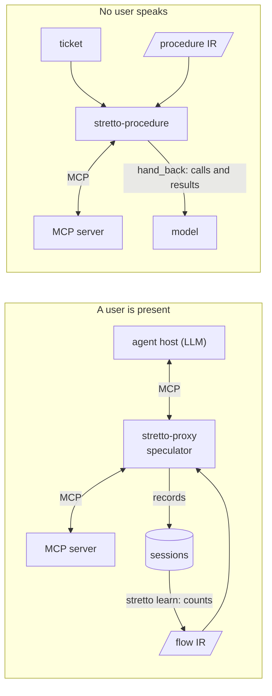

# Compile What the Environment Decides: Read-Only Speculation and Compiled Procedures for LLM Agents

*Draft, 2026-09-27.*

## Abstract

An LLM agent pays a model turn for every decision, yet many of its decisions are fixed by what its tools returned, not by what the user said. We make this precise and use it in two regimes. While a user is present, a program learned from traces can take over only reads, speculatively. Because reads leave the state unchanged until the next write, the decision to speculate separates over reads: make each read whose probability of use before the next write exceeds $\delta/(\beta+\delta)$, for a detour's cost $\delta$ and a saved turn's value $\beta$. That probability, not the next-step probability speculative-action systems rank by, is the one to estimate, and counting estimates it with a calibration error of 0.01–0.08 (against 0.06–0.16). Across nine frontier agents it never saw, the speculator takes 86% of retail's read-only ceiling in replay, 10 points more than the next-step speculator; live, with no model of its own, it cut GLM-5.3's LLM turns by 28% (95% CI 19–36%). Replayed from 89 more agents' published trajectories on six more benchmarks, in their own harnesses, three agent SDKs and real MCP servers, the ceiling runs from 3.5% to 47% of turns with where arguments come from, and the speculator gains where agents read ahead, stays out where it cannot help, and carries across harnesses. Ten of an agent's own sessions give 93–96% of what all of them do in retail and airline. Where no user speaks, a whole procedure, writes included, can be compiled once: on τ²-bench's solo telecom tasks, a cascade that hands a model only what the procedure's outcome check cannot confirm passes 39 of 40 held-out tasks at 0.48 LLM turns per ticket, against 15.9 for the model alone. Both run in stretto, an open-source MCP proxy and procedure runtime that serves any agent and any MCP server.

## 1 Introduction

Tool-using agents spend most of their cost in the LLM turns that decide the next call. Work that reuses traces to cut that cost either keeps the model in the loop (workflow memory [AWM], induced skills [ASI, SkillWeaver]) or compiles traces into programs that run without it [TraceCompiler, Compiled AI, PreAct]; work that speculates on the next action overlaps it with the model's own latency [Speculative Actions, Speculative Macro Commit]. Two questions sit under all of these: *which* of an agent's decisions a program learned from traces can take over at all, and *when* acting on a prediction pays.

We answer both with one distinction. Each decision of an agent is informed by the state the tools have returned (what is in the account, what the phone reports) and by what the user said (which order, which fault). A program learned from traces sees the first; the second needs language. A compiler can take the decisions the environment determines, and no more, and two regimes follow:

- **A user is present** (τ²-bench's retail, airline and dual-control telecom). Replies, and decisions the user's words trigger, stay with the model. What remains are reads whose arguments the tool state supplies. Reads are safe to make speculatively: they cannot change the state, and a wrong one costs a lookup.
- **No user speaks** (telecom's solo mode, where the agent operates the phone itself). Every branch follows a tool result, so the whole procedure, writes included, can be compiled once, and handed to a model only when the outcome the ticket states does not hold.

Contributions:

1. **What can be compiled, measured.** Every LLM turn of nine frontier agents on τ²-bench, classed by what decided it. A read-only speculator can save at most 29% of turns while a user is present, and reading the user's words would add less than a point. On six more benchmarks and 89 more agents, the ceiling runs from 3.5% of turns, where each request names what to read, to 47%, where one result names what every later read takes: it belongs to the domain, and is set by where arguments come from (§4.1).
2. **The probability that matters.** Because reads commute with each other and with the state until the next write, the decision to speculate separates over reads: make each read whose probability of use *before the next write* clears $\delta/(\beta+\delta)$, for a detour's cost $\delta$ and a saved turn's value $\beta$ (Proposition 3), and make it at once unless what the agent does before the speculator's next decision would show whether it will be used (Proposition 4). That probability, not the next-step probability that speculative-action systems rank by, is estimated by counting the same contexts for a different event. It is calibrated where the next-step estimate is not, the threshold follows from costs counted in the same traces, and the speculator it drives takes 86% of retail's ceiling across nine agents it never saw, 10 points more than the next-step speculator, and cut a live agent's LLM turns by 28% with no model of its own (§4.2–4.4).
3. **Compile once where no user speaks.** A procedure compiled from traces passes 35 of 40 held-out solo telecom tasks with no model and hands back exactly what its own check of the ticket's outcome cannot confirm; with a model on those, the cascade passes 39 of 40 at 0.48 LLM turns per ticket, against 15.9 for the model alone (§4.5).

Both run in stretto: an MCP proxy that serves the speculator between any agent and any MCP server, and a runtime that executes a compiled procedure against one. And because the replay rule counts only what a recorded call answered, a speculator can be replayed from a benchmark's published trajectories alone, with no environment: every benchmark that publishes its agents' runs is a test set, and we use six more (§3).

## 2 Model

### 2.1 Episodes, reads and writes

An episode is a sequence of LLM turns. In turn $k$ the agent emits either a message to the user or a set of calls $C_k$, each $c = (t, a)$ a tool $t$ with arguments $a$, whose results the environment returns before the next turn. Tools are *reads* $\mathcal R$, which leave the environment's state unchanged, or *writes* $\mathcal W$. We write $x_k$ for the *tool state* before turn $k$ (every call and result so far) and $w_k$ for the user's words so far.

A turn is *decided by the environment* when the agent's choice depends on $x_k$ alone: its policy satisfies $\pi(\cdot \mid x_k, w_k) = \pi(\cdot \mid x_k)$. A program learned from traces can represent such decisions and no others, since traces show it $x$ and, for the user's words, only their surface.

### 2.2 Speculation and its replay semantics

A *speculator* $\sigma$ maps a tool state to a set of reads with bound arguments, $\sigma(x) \subseteq \mathcal R$, which it makes after a tool response, before the agent's next turn, and whose results it appends to that response. A read made at time $s$ *answers* a later call $c$ of the agent at time $u > s$ if it is the same call and returned what $c$ would return at $u$; each read answers at most one call. With no write (the agent's or the user's) in $(s, u)$ it always does, since reads leave the state unchanged. A turn is *saved* when every call in it is answered; a read that answers no call is a *detour*.

**Proposition 1 (safety).** If $\sigma(x) \subseteq \mathcal R$ for all $x$, and the agent's calls are those it would make without $\sigma$ except that answered calls are omitted, then the environment's state after every write is the same with and without $\sigma$. (The proofs of the propositions are in Appendix A.)

So a speculator can change an episode's outcome only through the agent's context, never through the environment. Its worst case is a detour.

**Proposition 2 (ceiling).** A speculator whose arguments are bound from the tool state, and whose reads answer only calls with no write in between, saves at most the turns whose calls are all reads with every argument present in the tool state after a tool response since the last write.

We measure this ceiling on recorded episodes (§4.1). A read can also answer across a write that left its result unchanged, so a replay may save turns outside it: at least 1.5% of the turns the use-before-write speculator saves in §4.2 are, and 0.5% of the next-step speculator's.

### 2.3 The optimal speculator decomposes

At a decision point with state $x$, let $U(x)$ be the multiset of reads the agent would make, absent the speculator, before the next write, the agent's or the user's: the reads a lookup made now is sure to answer. For a candidate read $c$, answering one of the agent's calls is worth $\beta_c$ (the LLM turn it spares, and the call's tokens), and a detour costs $\delta_c$ (its result's tokens in every later turn's context, and the tool's own cost). We take these values to be additive over calls. That is exact when the agent makes one call per turn, as in 84% of the turns in the ceiling (§4.1); in a turn of parallel reads the turn is spared only when all are answered, so their values are complements, and the sum below is a first-order approximation.

**Proposition 3 (decomposition).** For a set $S$ of candidate reads, the expected utility is
$$\mathbb E\,u(S) = \sum_{c \in S} \big(q_c\,\beta_c - (1-q_c)\,\delta_c\big), \qquad q_c = \Pr\big(c \in U(x) \mid x\big),$$
and it is maximized by $S^\star = \{c : q_c \ge \delta_c / (\beta_c + \delta_c)\}$.

Proposition 3 takes the decision as final until the next write. The speculator decides again after each tool response the agent receives, so a read that clears the threshold now could instead wait for a later decision, which will know more. Waiting forfeits only the uses that come before that decision: let $n_c \le q_c$ be the probability that the agent calls $c$ before the speculator's next decision, that is, before any call of its own that no lookup answered.

**Proposition 4 (when to act).** Let $\theta^\star_c = \delta_c/(\beta_c+\delta_c)$. If what the agent does before the next decision tells nothing more about whether it will call $c$, making $c$ now is optimal exactly when $q_c \ge \theta^\star_c$. If it tells whether the agent will call $c$, making $c$ now is optimal exactly when $n_c\,\beta_c \ge (1-q_c)\,\delta_c$, which implies $q_c \ge \theta^\star_c$. With partial information, the reads worth making now include those of the second rule and are among those of the first.

Three consequences follow. First, the next-step probability is the wrong quantity under either rule. A reply to the user is a step of the agent's but not a decision of the speculator's, since it returns no tool result, so a read the agent makes after replying is one the speculator must make before the reply: $\Pr(c \text{ next} \mid x) \le n_c \le q_c$, and a speculator that thresholds the next-step probability acts too rarely. Second, the two rules part only over the uses that come after a later decision, $q_c - n_c$. The speculator answers most of the calls that would come between, so in replay 94% of the lookups that paid while a user was present were used before its next decision (§4.2), and we act on $q_c$ at once. Third, the threshold is a ratio of costs, not a tuning knob, and both costs can be counted. Live, a detour carried 2,530 input tokens over the rest of its episode and a saved turn saved 6,000, so $\theta^\star = \delta/(\beta+\delta) \approx 0.30$; counted in recorded episodes the same ratio comes out at 0.30 in retail and at 0.12–0.13 in airline and telecom, whose contexts are longer and whose results are shorter (§3). We use each domain's average. Priced per decision instead, the rule gains in airline and telecom and loses in retail, where it spends a score that is off where it is priced (Appendix B).

The contrast with speculative decoding is the point. A drafted token is wasted when any token before it is rejected, because a sequence must match as a whole, so draft trees rank tokens by the product of confidences along their path [EAGLE-2, SpecDec++]. Reads form a set: each is used or not on its own, whenever the agent gets to it, and the path product is the wrong criterion.

### 2.4 Estimating the probability of use by counting

We factor a candidate read's probability of use into its tool and its arguments, $q_c \approx r(t \mid h)\,\rho(a \mid t, x)$, and estimate both from other agents' traces by conjugate updating.

**The tool.** Each step of an episode is abstracted to its tool, its outcome (returned, failed) and a feature of its result; $h$ is the sequence of abstract steps. The *habit* is a hierarchical Dirichlet back-off model of the next step over the last $j \le 2$ steps [MacKay & Peto 1995]:
$$p_j(t \mid h_j) = \frac{n(h_j, t) + \alpha\, p_{j-1}(t \mid h_{j-1})}{n(h_j) + \alpha}, \qquad p_{-1} \text{ uniform},$$
whose concentration $\alpha$ has a posterior we sample. It is the posterior predictive of a Dirichlet–multinomial at each context, with the shorter context as its prior mean. (One detail of the habit as served is in Appendix D.) The quantity Proposition 3 needs is not the next step but the event $t \in U$. We count it over the same contexts: $m(h_j, t)$ is the number of training steps after $h_j$ from which the agent called $t$ before its next write, and each tool is its own Beta–Bernoulli, backed off the same way,
$$r_j(t \mid h_j) = \frac{m(h_j, t) + \alpha\, r_{j-1}(t \mid h_{j-1})}{n(h_j) + \alpha}.$$
The $r_j(\cdot \mid h_j)$ need not sum to one: after a customer lookup, the agent reads the user and then an order before its next write. The same counts, a different event.

**The arguments.** For each argument of each read tool, the traces show where the agent took its value: the path of an earlier result, in the order the agent used such sources at this site. The binding takes the value at the first source that holds one. Its chance $\rho$ is the rate at which the agents passed that value in training, shrunk towards the site's rate $\bar\rho$ with a Beta prior of weight 2,
$$\rho = \frac{k + 2\bar\rho}{n + 2},$$
counted separately where the user had named another record of the list, and where the record the user described had already been read. These counts cover the case that dominates the errors: the right tool on the wrong record.

The speculator makes the reads that clear $\theta$ one at a time, each conditioned on those before it (Algorithm 1). Learning is counting: the model has no gradient-trained parameter, and runs as a probabilistic program [fugue] whose predictive is closed-form. We compare it with the rule it replaces, which takes the likeliest *next* tool and makes it when $p\,\rho \ge \theta$.

```text
Algorithm 1. The speculator, after each of the agent's tool responses.
  input: tool state x, abstract history h, threshold θ
  loop
    C ← { (t, a) : t a read, a = bind(t, x) defined }   # bind skips values an earlier call of t passed
    if C = ∅: stop
    (t*, a*) ← argmax over C of r(t | h) · ρ(a | t, x)
    if r(t* | h) · ρ(a* | t*, x) < θ: stop
    y ← call t*(a*); append (t*, a*, y) to the response; x ← x + (t*, a*, y); h ← h + abstract(t*, y)
```

### 2.5 Compile once where no user speaks

Where the environment decides every branch, we compile the policy itself. At each *site* (the tool that just returned, or the start), a decision tree over the tool state's features predicts the next call, as decision mining learns the branches of a process from its logs [Decision mining] (ID3, depth by cross-validation over tasks). Its actions are whole calls, whose identifiers are learned as *provenance*: the path of the result that held the value (with, in a list of records, the fields that set the chosen record apart), or the shape it had in the task's ticket. They are bound again at run time from that run's results. A guard forbids repeating a read before a write, or a write. The run stops when the tree says so, and then checks the ticket's stated outcome with a read. It hands the task to a model only when that check fails, with its calls and their results as the model's context: a *cascade*, in which, as in model cascades [Cascades], the expensive model sees only what a cheap check cannot confirm. The procedure is data, a file of trees, bindings and checks, which a small runtime executes against any MCP server.

### 2.6 The system

stretto implements both regimes for any agent and any MCP server. `stretto-proxy` sits between the agent's host and the server as a stdio MCP server, forwards every message, records sessions, and, after each of the agent's calls, runs the speculator: the lookups it makes ride in the same tool result, so the agent sees them with no new tool and no change to its prompt. The speculator is a file, the flow IR: the counts of §2.4, the lookups each site may make, and where each argument comes from. `stretto learn` writes it from recorded sessions, and since every estimate is a posterior predictive of conjugate counts, learning from another session adds its counts; the flow can be reviewed as a diff, shadowed, and promoted site by site. Its run after each call is a probabilistic program [fugue] whose three interpreters simulate it, execute it against the server, and score a recorded session under it. A compiled procedure is also a file, the procedure IR, and `stretto-procedure` runs it against a server and returns its calls and verdict. Nothing in either file is a model weight: a flow or a procedure is data a person can read.

Serving is guarded where a deployment needs it, from tools a flow may call to shadow mode and pseudonymized sessions (Appendix D). Deciding takes under a millisecond per tool response (§4.4).



*Figure 1. The two regimes in stretto. Left: the proxy forwards every message, records sessions, and after each of the agent's calls makes the lookups the flow decides on, inside the same tool result. Right: a compiled procedure runs with no model and hands a ticket to one only when its check of the stated outcome fails.*

## 3 Setup

**Tasks.** τ²-bench [Barres et al. 2025] has three customer-service domains with a simulated user: retail (114 tasks), airline (50) and telecom (114), where in telecom the user also operates a phone, and a solo mode of telecom in which the agent operates it and no user speaks. We use its train/test split (74/40, 30/20, 74/40) throughout: nothing is learned from a test task.

**Agents.** For replay, the recorded test episodes, four trials each, of the nine agents on τ²-bench's leaderboard with trajectories published in all three domains: GLM-5, Qwen3.5-397B, Qwen3-Max, GPT-5.2 at high and no reasoning, Claude Opus 4.5, Claude Sonnet 4.5, Gemini Pro and Gemini Flash. Speculators are learned from other agents: the training episodes of τ²-bench's four 2025 runs (Claude 3.7 Sonnet, GPT-4.1, GPT-4.1-mini, o4-mini), so every replay is of agents the speculator never saw. In solo telecom, the runs of GPT-4.1 and o4-mini, each under the written manual and the written workflow policy.

**Replay.** A replay re-executes each recorded episode's calls in order in τ²-bench's environment, with the speculator serving lookups after each call as it would live, and scores it by §2.2: a recorded call is skipped when a lookup answered it, a turn is saved when all its calls are, a lookup that answers none is a detour. A replay counts what the speculator would have spared an agent that otherwise acted as recorded (§6; details in Appendix D). Intervals are 95%, from a bootstrap over tasks, a task's four trials drawn together.

**Other benchmarks.** Six more benchmarks publish their agents' trajectories with every call's result: τ-bench [τ-bench] (GPT-4o and Claude 3.5 Sonnet in retail and airline, in τ-bench's own harness), the Berkeley Function Calling Leaderboard's multi-turn base tasks [BFCL] (the leaderboard's own logs of 18 models), AgentDojo [AgentDojo] (21 models' benign runs of its workspace, Slack, banking and travel suites), WorkBench [WorkBench] (24 models' 2026 runs of its 690 tasks in six domains [WorkBench Revisited]), DTap-Bench [DTap] (the benign tasks of four of its domains, customer service, CRM, telecom and travel, 575 tasks run by seven agents built on the Claude Agent SDK, the OpenAI Agents SDK and Google's ADK; its fourth harness, OpenClaw, logs no calls) and MCPMark [MCPMark] (17 models' runs of tasks on real MCP servers: a filesystem, PostgreSQL, GitHub and Notion). Each is rewritten in τ²-bench's format with its tools marked read or write, checked against the benchmark's source (DTap-Bench's and MCPMark's by their verbs), and its results rendered as JSON; 40% of tasks are held out. Speculators are learned from the older agents' training episodes and replayed on the newer agents' test episodes: 8 models to 10 in BFCL, 11 to 10 in AgentDojo, 10 to 14 in WorkBench, 8 to 9 in MCPMark. On τ-bench the τ²-bench speculators are replayed as they are. DTap-Bench's agents are contemporaries, so each agent's test episodes are replayed with speculators learned from its own training episodes, from its harness's other agents, and from the other harnesses' agents.

**Replay from the record.** These benchmarks cannot be re-run cheaply, so their replays answer every call from the recorded trajectory. A lookup that the agent's own later call answers, before its next write, gets that call's result, which is exact; any other lookup is a detour, gets a stand-in result, and never counts as a saving. On τ²-bench's nine agents, this counts 96.7% of the turns the environment replay saves and 91% of the use-before-write speculator's lead over the next-step speculator, but only 55–72% of the detours, which are therefore lower bounds (Appendix D).

**Learning curves.** A deployment learns from the sessions it serves. For three agents (GLM-5, Claude Sonnet 4.5 and Qwen3.5-397B), we order the agent's training episodes at random, three orders each, learn a speculator from the first $n$ ($n$ = 10, 30, 60, 100, 200, and all: 296 in retail and telecom, 120 in airline), and replay it on the agent's test episodes at $\theta = 0.3$. As the alternative a deployment could start from, we do the same with the four 2025 runs' training episodes (to all 1,184; 480 in airline). And as a deployment that starts from those and adds the agent's own as they arrive, we learn from the agent's first $n$ together with all of the 2025 runs' training episodes, or with 100 of them drawn at random (three draws).

**Live.** GLM-5.3 runs in Claude Code with τ²-bench's system prompt and no built-in tools; τ²-bench's tools are served over MCP behind `stretto-proxy`, which records the session and runs the speculator. The user is GLM-5.3 prompted as τ²-bench's user simulator. Rewards are τ²-bench's own checks of the final database, and in solo telecom of the environment and the required actions.

**Costs.** A detour's cost $\delta$ and a saved turn's value $\beta$ are in input tokens. On the live paired run the flow's 17 detours carried 43,000 input tokens over the rest of their episodes, and its 260 saved turns saved 1.56M: $\beta \approx 6{,}000$, $\delta \approx 2{,}530$ and $\theta^\star = \delta/(\beta+\delta) \approx 0.30$. Counted in the recorded episodes (Appendix B), retail's costs give $\theta^\star = 0.298$, what the live run measured; airline's and telecom's, whose contexts are longer and detours shorter, 0.13 and 0.12; solo telecom's 0.06. Utilities are at each domain's own costs.

## 4 Results

### 4.1 What decides an agent's turns

Over 39,298 LLM turns of nine agents' test episodes (§3), 46.8% reply to the user, 12.2% write and 41.0% only read (Table 1). A speculator that binds arguments from the tool state could have saved at most the reads whose every argument sits in an earlier result, after a tool response since the last write: 29.0% of all turns (retail 34.2%, airline 29.5%, telecom 24.7%), from 16% to 41% by agent and domain. Allowing an argument to be a value the user wrote raises the ceiling by 0.7 points. In 84% of the turns in the ceiling the agent made one call (78% in airline, 87% in telecom); the rest are parallel reads. The rest of the turns, seven in ten, stay with the model: they reply, write, or read what only the user's words can name.

*Table 1. LLM turns of nine agents' test episodes by what they do, and the read-only ceiling (Proposition 2). Pooled over agents, with the range across agents in brackets.*

| | Turns | Replies | Writes | Reads | Ceiling |
|---|---|---|---|---|---|
| Retail | 14,106 | 39.6% [34–44] | 14.0% [12–17] | 46.3% [42–53] | 34.2% [29–41] |
| Airline | 7,530 | 40.3% [29–54] | 12.7% [11–18] | 46.9% [35–60] | 29.5% [16–40] |
| Telecom | 17,662 | 55.2% [41–60] | 10.6% [8–12] | 34.3% [30–46] | 24.7% [17–38] |
| All | 39,298 | 46.8% | 12.2% | 41.0% | 29.0% |

**The ceiling is the domain's.** Classed the same way, τ-bench's turns divide as τ²-bench's do to within two points (Table 1b), though its agents are a year older and ran in another harness. Across benchmarks, reads are about a third to three quarters of turns, and what varies is where their arguments come from. In τ-bench, as in τ²-bench, the user names themselves and the agent walks the records, and 28% of turns are in the ceiling. In AgentDojo's travel suite, a city's listing names the hotels that every later lookup takes, and 47% are. In WorkBench, each request names its customer, task or date, and only 3.5% are; on MCPMark's real servers, where agents write their own SQL and choose which files and issues to read, 7.0%. On Notion, whose pages an agent walks block by block by the ids each listing returns, the agent decides: 22–34% of the Claude models' and Gemini 2.5 Pro's turns are in the ceiling, and at most 4% of the others'. GPT-5 and o3 pass a page size with every read of a block, a constant that a speculator binding from results does not supply; counted in, constants would raise Notion's ceiling from 7.9% to 13.2%, DTap-Bench CRM's by 2.0 points, and any other by under one. Reading the user's words would add 5–9 points in BFCL, AgentDojo, WorkBench and DTap-Bench, against under two in τ²-bench and τ-bench, whose users give their details over the conversation. A speculator that binds from results pays where agents walk records; where requests name what to read, the lever is language. How an agent groups its calls is part of the ceiling too: in DTap-Bench's customer service and travel, Gemini 3 Pro on Google's ADK batches its reads into a few parallel turns and leaves 7.6% and 0.5% of its turns in the ceiling, against 13–34% for the other agents. The format is part of the ceiling too. Read as AgentDojo prints them, as YAML and Python literals, its results hold few values a parser can find, and its ceiling is 10.0%.

*Table 1b. The same classes on six more benchmarks: the test episodes of the agents replayed in §4.2.*

| | Agents | Turns | Replies | Writes | Reads | Ceiling | With the user's words |
|---|---|---|---|---|---|---|---|
| τ-bench (retail, airline) | 2 | 6,244 | 47.0% | 13.2% | 39.7% | 28.4% | 29.8% |
| BFCL multi-turn | 10 | 8,510 | 34.9% | 33.7% | 31.5% | 13.2% | 18.6% |
| AgentDojo (4 suites) | 10 | 1,523 | 26.9% | 16.5% | 56.5% | 22.1% [6.0–47.1] | 27.1% |
| WorkBench (6 domains) | 14 | 13,869 | 27.4% | 26.6% | 46.1% | 3.5% [0.0–6.4] | 10.9% |
| DTap-Bench (4 domains) | 7 | 15,383 | 14.2% | 36.1% | 49.7% | 19.6% [11.5–34.3] | 26.6% |
| MCPMark (4 servers) | 9 | 6,531 | 5.1% | 50.9% | 43.9% | 7.0% [2.5–10.9] | 10.6% |

Brackets give the range over suites or domains.


*Figure 2. The read-only ceiling by benchmark and domain (test episodes of the replayed agents, §3), and on top what a speculator that also bound values from the user's words could add. Where the agent walks records, results bind the arguments; where each request names what to read, only language does.*

### 4.2 Speculation in replay

**The next-step probability understates the probability of use.** Replays log every lookup a speculator weighed with whether the agent made that call before its next write. After a user's details, GLM-5 and Claude Sonnet 4.5 read an order *next* with probability 0.64 under the habit, but read it before their next write 94% of the time; after an order, a product comes next with probability 0.08, but before the next write 38% of the time, once the agent has told the user what the order holds. Over all lookups the share used ran far above the habit's score: 0.94 of lookups scored 0.4–0.5 were used, 0.97 of those scored 0.5–0.6, and 0.48 of those scored 0.05–0.10 (GLM-5, retail). Counting the right event (§2.4) lowers the calibration error and the Brier score in every domain, each interval excluding zero, and ranks lookups better everywhere but telecom, where the two rank alike (Table 2).

*Table 2. Calibration of the score $q = p\,\rho$ against use before the next write, over every lookup the speculators weighed in replay (nine agents; two in solo telecom): expected calibration error (10 bins), Brier score, and AUC, with 95% intervals for each difference from a bootstrap over tasks shared by both.*

| | Lookups weighed | ECE, next step → use before write | Brier | AUC |
|---|---|---|---|---|
| Retail | 20,673 / 21,175 | 0.164 → 0.083 [−0.098, −0.047] | 0.142 → 0.100 [−0.055, −0.029] | 0.929 → 0.950 [+0.006, +0.037] |
| Airline | 17,124 / 17,174 | 0.106 → 0.068 [−0.042, −0.029] | 0.104 → 0.092 [−0.015, −0.009] | 0.821 → 0.845 [+0.002, +0.047] |
| Telecom | 33,844 / 34,976 | 0.069 → 0.049 [−0.025, −0.011] | 0.073 → 0.062 [−0.013, −0.008] | 0.925 → 0.930 [−0.007, +0.017] |
| Telecom, solo | 32,291 / 32,029 | 0.056 → 0.014 [−0.050, −0.023] | 0.080 → 0.074 [−0.009, −0.002] | 0.763 → 0.818 [+0.036, +0.071] |


*Figure 3. Reliability of the two scores (bins of at least 100 lookups). The next-step score sits above the diagonal: lookups it rates 0.4–0.6 are used nine times in ten.*

**At the cost-derived threshold the right probability saves more.** Across a sweep of thresholds (Figure 4), the speculator on the probability of use traces a frontier of turns saved against detours that reaches beyond the next-step speculator's. Priced at each domain's counted costs, its utility peaks where $\theta^\star$ puts it in four of the six agent and domain pairs swept, and in the other two at 0.4–0.5, for agents the population's scores fit worst (Appendix B). It is also robust to the threshold: past its peak its utility falls slowly, where the next-step speculator's collapses beyond 0.4–0.5, since next-step scores seldom exceed one half. Over nine agents at $\theta = 0.3$ (Table 3), it takes 86.4% of retail's ceiling, against the next-step speculator's 76.2% (+10.2 points, 95% CI 6.7–14.2), for 0.16 more detours per episode: a net 1.6 thousand input tokens saved per episode (0.8–2.5). The gain holds for each of the nine agents, from 2.9 to 4.4 points of turns saved. In telecom it takes 3.8 more points of the ceiling for twice the detours, which telecom's costs make worth it: +0.60 thousand tokens per episode (0.30–0.91), where at retail's costs, with a detour twice as dear against a saved turn, the two would be even. In solo telecom it saves 1.7 thousand more (0.6–2.9), and in airline the two make nearly the same lookups (+0.10, 0.00–0.25).


*Figure 4. Utility against the threshold, in millions of the agent's input tokens at its domain's counted costs, on the test episodes of GLM-5 and Claude Sonnet 4.5 (retail, airline, telecom) and GPT-5.2 without reasoning (telecom), for speculators learned from the 2025 runs; the dashed line is the domain's $\theta^\star$. Every cell is in the round's published rows.*

*Table 3. Nine agents' test episodes at θ = 0.3, pooled per domain: LLM turns saved, detours per episode, share of the read-only ceiling, and utility per episode in thousands of input tokens at the domain's own costs (§3), with 95% intervals from a bootstrap over tasks shared by both speculators.*

| | Speculator | Turns saved | Detours per episode | Share of ceiling | Utility per episode |
|---|---|---|---|---|---|
| Retail | next step | 26.1% [24.0, 28.1] | 0.34 [0.23, 0.44] | 76.2% [71.7, 81.6] | 14.1 [12.6, 15.4] |
| | use before write | **29.6%** [27.2, 32.0] | 0.50 [0.36, 0.65] | **86.4%** [80.2, 93.1] | **15.6** [14.1, 17.2] |
| | difference | +3.5 [2.3, 4.9] | +0.16 [0.06, 0.29] | +10.2 [6.7, 14.2] | +1.6 [0.8, 2.5] |
| Airline | next step | 13.6% [10.4, 17.0] | 0.35 [0.22, 0.48] | 46.2% [38.3, 55.1] | 9.67 [7.37, 12.31] |
| | use before write | 13.7% [10.6, 17.2] | 0.35 [0.22, 0.48] | 46.6% [38.5, 55.4] | 9.77 [7.44, 12.39] |
| | difference | +0.1 [0.0, 0.3] | 0.00 | +0.5 [0.0, 1.1] | +0.10 [0.00, 0.25] |
| Telecom | next step | 11.8% [10.8, 12.9] | 0.31 [0.27, 0.35] | 47.9% [45.5, 50.3] | 12.6 [12.1, 13.1] |
| | use before write | 12.8% [11.6, 14.0] | 0.66 [0.56, 0.76] | 51.7% [49.0, 54.4] | **13.2** [12.6, 13.7] |
| | difference | +0.9 [0.7, 1.2] | +0.35 [0.27, 0.44] | +3.8 [2.7, 4.8] | +0.60 [0.30, 0.91] |
| Telecom, solo† | next step | 19.9% [18.4, 21.7] | 1.48 [1.27, 1.70] | 40.0% [36.9, 43.9] | 25.4 [23.7, 27.2] |
| | use before write | 21.3% [19.4, 23.5] | 1.70 [1.50, 1.92] | 42.8% [39.0, 47.0] | **27.2** [25.1, 29.3] |
| | difference | +1.4 [0.5, 2.3] | +0.22 [0.09, 0.34] | +2.8 [1.1, 4.6] | +1.72 [0.56, 2.88] |

† Two agents, GPT-4.1 and o4-mini, the only published solo runs; the speculator is learned from their own training episodes.

**In seconds and dollars.** Six agents' episodes report each LLM turn's generation time and cost: Claude Opus and Sonnet 4.5, Gemini Pro and Flash, and GPT-5.2 at both settings. Priced there, the turns the use-before-write speculator saves in retail, 28% of all turns, are 24% of the episodes' generation time, 36 seconds an episode, and 18% of their cost net of its detours at the agent's input price; the next-step speculator's are 20% and 15%. In airline both save 7% of the time and 6.5% of the cost, and in telecom 12% of the cost. A turn that only reads generates less than one that replies, so the shares trail the share of turns (`scripts/priced.py`).

**On other benchmarks.** The use-before-write speculator saves more than the next-step one where agents read ahead of their next write, and ties elsewhere (Table 3b). On τ-bench, the speculators learned from τ²-bench's 2025 runs, replayed on 2024 agents in another harness, save 22.9% of retail's turns, 76% of its ceiling, 1.4 points more than the next-step speculator (0.8–2.1); the two tie in airline, as on τ²-bench. In retail they answer 42% of GPT-4o's API calls and 45% of Claude 3.5 Sonnet's with each call's exact arguments and result, making one lookup for about every two calls, three quarters of them used. On the same benchmark, Speculative Actions' model speculators predicted 22–38% of the calls with one to three guesses a step [Speculative Actions]; their agent differs and they guess the next step, writes included, so the comparison is indicative, not controlled. On BFCL, learned from eight older models and replayed on ten late-2025 ones, it saves about twice the next-step speculator's turns at every threshold from 0.1 to 0.5 (+0.85 points at 0.3, 0.35–1.45). Both take little of BFCL's ceiling, whose 200 tasks are 200 different requests over 128 tools. On AgentDojo the two tie (−0.5 points, −1.7 to 0.0). In Slack they make the same lookups and take 78% of its ceiling. On WorkBench, whose reads take what the request names, neither makes a single lookup: a speculator that cannot help stays out of the way, once it scores a lookup without arguments by how often the agent's own calls had none (Appendix D). On MCPMark's servers the speculators make 29 lookups in 396 episodes at $\theta = 0.3$ and save 0.2% of turns, 3% of the ceiling; learned from each model's own training episodes, 0.4%, and 0.6% once they also pass the constants each agent always passes (Appendix D). Notion shows why: after a block's children the agents' next call is for another block's children 55% of the time, but a binding picks the block they open 38% of the time. At 0.1 the speculators take 43% of the Claude models' and Gemini 2.5 Pro's ceiling there, at 14 detours an episode. The walk is predictable; the step is not.

**Across harnesses.** DTap-Bench runs the same tasks under three agent SDKs. Over its four domains, the use-before-write speculator saves more than the next-step one whichever agents it learned from. Learned from each agent's own training episodes, it saves 8.0% of turns against 4.9% (+3.1 points, 2.7–3.6), for 0.51 detours per episode against 0.09; learned from the other harnesses' agents, 5.5% against 3.3% (+2.1, 1.7–2.6), for 0.28 detours. It leads in each domain, least in CRM, whose ceiling is 11.5% (+0.1 to +0.8 points), and with the agents' own sessions takes 86% of travel's ceiling. A speculator learned in other harnesses keeps 64% of what the agent's own saves, with half its detours, and one learned from the agent's harness-mates keeps 85%. Each SDK here runs one vendor's models, so harness and model family go together: the GPT-5 models keep 91% from each other, and Claude Opus 4.6 keeps as much from the other harnesses' agents (60%) as from Claude Sonnet 4.5 in its own (59%). Learned from all seven agents, the speculator keeps 94% of the own speculators' turns with 79% of their detours.

*Table 3b. Replays from the record at θ = 0.3: turns saved and detours per episode (lower bounds), with 95% intervals for the difference from a bootstrap over tasks.*

| | Turns saved, use before write | Next step | Difference | Detours per episode, use before write / next step |
|---|---|---|---|---|
| τ-bench retail | 22.9% | 21.5% | +1.4 [0.8, 2.1] | 0.92 / 0.85 |
| τ-bench airline | 17.1% | 17.1% | 0.0 | 0.41 / 0.41 |
| BFCL | 1.6% | 0.7% | +0.85 [0.35, 1.45] | 0.09 / 0.05 |
| AgentDojo | 7.2% | 7.7% | −0.5 [−1.7, 0.0] | 0.10 / 0.11 |
| WorkBench | 0.0% | 0.0% | 0.0 | 0.00 / 0.00 |
| MCPMark | 0.2% | 0.2% | 0.0 | 0.04 / 0.03 |
| MCPMark, own sessions | 0.4% | 0.4% | 0.0 | 0.72 / 0.65 |
| DTap-Bench, other harnesses | 5.5% | 3.3% | +2.1 [1.7, 2.6] | 0.28 / 0.11 |
| DTap-Bench, own sessions | 8.0% | 4.9% | +3.1 [2.7, 3.6] | 0.51 / 0.09 |

**Acting at once.** Of the lookups the use-before-write speculator made at $\theta = 0.3$ that the agent then used, 96.5% in retail, 93.6% in airline and 90.8% in telecom came before the speculator's next decision, when no later decision could have made them in time. Waiting, Proposition 4's second rule, has little to gain, and estimating what it needs from other agents' traces gives the gain back (Appendix C).

### 4.3 Learning from few sessions

A deployment learns from the sessions it serves (§3). From ten of an agent's own sessions, the speculator saves 27.5% of its retail turns and 14.9% of its airline turns, 96% and 93% of what it saves from all of them; telecom needs about thirty (80% of the final savings at ten, 97% at thirty) (Table 4, Figure 5). Past that, more sessions buy fewer detours, not more saved turns: from 0.64 to 0.52 per episode in retail and from 0.74 to 0.40 in airline. Where agents act alike, other agents' sessions teach as much as the agent's own: in retail and airline the two protocols stay within two points of each other at every $n$. Where they do not, only the agent's own sessions teach its habits: in telecom, a hundred of an agent's own sessions save 15.2% of its turns, more than all 1,184 of the other agents' (12.6%), and more for each of the three agents; for GLM-5, 8.8% against 3.4%.

**Other agents' sessions are a prior.** Since learning is counting, a deployment can start from other agents' sessions and add the agent's own as they arrive; what is left to choose is how much the others weigh. At full weight they drown the agent out: added to all 1,184 of the 2025 runs' sessions, a hundred of an agent's own barely move its telecom speculator (13.0% of turns, against 12.6% with none of them and 15.2% from its own alone; for GLM-5, 3.4% at every $n$). Weighed as a hundred sessions, drawn at random, as a power prior discounts historical data [Ibrahim & Chen], they teach what they can and then give way (Table 4): in telecom the speculator saves 13.3% of turns from ten of the agent's own sessions, more than from either those ten or all of the others', and 15.0–15.4% from a hundred or more; in retail and airline, where agents act alike, about what all of the others' give (29.9–30.7% and 15.2–15.8%). Priced at each domain's costs, it comes within 0.5 thousand tokens per episode of the better of the two at every $n$, and beats both at ten sessions in telecom. A hundred is about where the others' own curve flattens, and the choice matters little: with 30 or 300 of them, the speculator saves about the same from a hundred of the agent's own sessions (retail 29.9% and 30.1% of turns, telecom 15.1% and 14.9%), and a lighter prior lets the agent's habits in sooner (GLM-5 in telecom, from ten of its sessions: 4.8% with 30, 3.0% with 300).

*Table 4. LLM turns saved · detours per episode for a speculator learned from the first $n$ sessions and replayed on the agent's test episodes at $\theta = 0.3$: mean over GLM-5, Claude Sonnet 4.5 and Qwen3.5-397B, three random orders each. "All" is 296 of the agent's own sessions in retail and telecom (120 in airline) and 1,184 of the other agents' (480 in airline). The third row of each domain learns from 100 of the other agents' sessions, drawn at random, and the agent's first $n$.*

| Domain | Learned from | n = 10 | n = 30 | n = 100 | All |
|---|---|---|---|---|---|
| Retail | the agent's own sessions | 27.5% · 0.64 | 28.8% · 0.65 | 29.3% · 0.64 | 28.5% · 0.52 (296) |
|  | four other agents' sessions | 29.3% · 0.97 | 29.6% · 0.80 | 28.3% · 0.68 | 30.2% · 0.55 (1184) |
|  | 100 of theirs, then its own | 29.9% · 0.70 | 30.1% · 0.69 | 30.5% · 0.69 | 30.7% · 0.60 |
| Airline | the agent's own sessions | 14.9% · 0.74 | 15.5% · 0.37 | — | 16.1% · 0.40 (120) |
|  | four other agents' sessions | 14.7% · 0.93 | 15.2% · 0.63 | 15.1% · 0.48 | 15.7% · 0.40 (480) |
|  | 100 of theirs, then its own | 15.2% · 0.31 | 15.4% · 0.31 | — | 15.8% · 0.33 |
| Telecom | the agent's own sessions | 12.4% · 0.56 | 15.1% · 1.17 | 15.2% · 0.74 | 15.5% · 0.73 (296) |
|  | four other agents' sessions | 10.0% · 0.30 | 11.4% · 0.31 | 12.4% · 0.53 | 12.6% · 0.51 (1184) |
|  | 100 of theirs, then its own | 13.3% · 0.57 | 14.6% · 0.72 | 15.0% · 0.90 | 15.4% · 0.86 |


*Figure 5. Turns saved (top) and detours per episode (bottom) against the sessions learned from, on a log scale: mean over three agents and three orders. The dotted line learns from 100 of the other agents' sessions, drawn at random, and the agent's first $n$.*

### 4.4 Live

Live, the speculator runs in `stretto-proxy` between the agent and the tools, over MCP: GLM-5.3 in Claude Code on τ²-bench's own prompts, with GLM-5.3 as the user. The earlier flow, which weighs the habit's next-step probability with an LLM's answers about the state [D0], cut LLM turns by 25.5% (95% CI 20.5–30.4%) over 80 paired retail and airline tasks, with 71 passed without it and 70 with it. The speculator of §2.4, deciding on the probability of use before the next write at $\theta = 0.3$, the live-measured $\theta^\star$, and asking no model, ran on 20 retail and 8 airline test tasks drawn at random from those 80, against the same recorded baseline (Table 5). It cut turns by 27.9% (19.1–35.9%) over the 28, where the earlier flow had cut 23.0% on the same tasks, and input tokens by 21.9% (9.9–32.9%); 23 of the 28 took fewer turns. The replay's assumption held throughout: of the speculator's 101 lookups, the agent made none again before the next write. Deciding took the speculator under a millisecond per tool response (at most 4 ms); its lookups add only the tools' own latency, where an LLM turn takes seconds.

*Table 5. Live, GLM-5.3 as agent and user, against the paired run's recorded baseline (airline: the mean of its two trials; passes: its first). 95% intervals from a bootstrap over tasks.*

| | Tasks | LLM turns, baseline → speculator | Change | Passed: baseline, D0, speculator |
|---|---|---|---|---|
| Retail | 20 | 227 → 154 | −32.2% [−40.0, −23.5] | 17, 14, 16 |
| Airline | 8 | 83.5 → 70 | −16.2% [−37.2, +10.6] | 7, 7, 5 |
| Both | 28 | 310.5 → 224 | −27.9% [−35.9, −19.1] | 24, 21, 21 |

Five pairs disagree on the outcome: four passed only without the speculator and one only with it (McNemar $p = 0.38$). In all four, every lookup the speculator made returned what the baseline agent's own read had returned, and the episodes parted later: twice at the simulated user's choice (the reason given for a cancellation; two items changed instead of one), and twice at the agent's decision after a user's plea (an exception granted on a basic-economy booking, as the earlier flow's agent had also granted; another route searched, whose fare the user declined). Twenty-eight tasks cannot separate an effect of lookups on the agent's later decisions from the agent's own variance, and we claim neither; the 80 pairs bound the earlier flow's loss at 7.5 points.

### 4.5 Compiling where no user speaks

In telecom's solo mode the agent operates the phone itself, and every branch follows a tool result. The procedure compiled from the successful training episodes of four solo runs (GPT-4.1 and o4-mini, each under the written manual and the written workflow policy; 730 episodes of 74 tasks) passes 35 of the 40 held-out tasks with no model, where the agents it was compiled from pass 49–78% (Table 6). Its identifiers bind for customers no trace saw: renamed throughout the database it passes the same 35, and on another customer's account 35, where constants pass 16 and 19. Its own check of the ticket's stated outcome resolves 25 runs, transfers 11 to a person as the policy directs, and hands back 4, all four failures; it misses one failure, a run it judged resolved.

The cascade gives the handed-back tickets to a model, which takes over from the procedure's state with its calls and results as context. Live, with GLM-5.3 in Claude Code on τ²-bench's solo protocol, it resolved all four in both of two trials, in 4.75 LLM turns each. On the same four tickets from scratch it resolved three, in 12–19 turns, and on four other tickets three, in 14–21. The cascade passes 39 of 40 held-out tasks and makes 0.48 LLM turns per ticket, where GLM-5.3 alone made 15.9.

*Table 6. Telecom solo, 40 held-out tasks. LLM turns per ticket for the agents are their recorded averages; for GLM-5.3 alone, over the eight tickets run.*

| | Passed | LLM turns per ticket |
|---|---|---|
| Agents compiled from (4 runs, 4 trials) | 49–78% | 14.7–18.1 |
| GLM-5.3 alone (8 tickets) | 6 of 8 | 15.9 |
| Compiled procedure alone | 35 of 40 | 0 |
| Procedure, then GLM-5.3 on its 4 hand-backs (2 trials) | 39 of 40 | 0.48 |

The procedure is a file stretto runs: `stretto-procedure` executes it against any MCP server, and on all 40 held-out tasks it made exactly the calls of the reference implementation, with the same rewards and verdicts.

## 5 Related work

**Reusing traces with the model in the loop.** Workflow memory [AWM] and induced skills [ASI, WALT, SkillWeaver] give the agent text or callable routines mined from its own successes; they save 10–27% of steps on web tasks, and AWM's workflows offered as callable actions were used in 18.5% of tasks. Agentic plan caching reuses plan templates from earlier runs, matched by keywords and adapted to the new task by a small model, and halves the cost of several agent applications [APC]. They change what the model sees. We change neither the prompt nor the tool list: the speculator's reads arrive inside results the agent asked for.

**Compiling traces into programs.** Where a task recurs without branching, a compiled program removes the model almost entirely [LOOP, Compiled AI, PreAct]. TraceCompiler compiles multi-turn API traces into workflows with argument provenance, classes each binding as constant, user input, copy, transform or dynamic, and declines to compile an intent whose irreversible effect is under-determined; its authors report no rate at which intents compile. Robotic process mining reached the same condition for automating a step, that each parameter is computable from earlier ones [Bosco et al., Leno et al.]. Our §2.1 names the condition these systems share, that the environment decides the step, and §4.1 measures it on every turn of nine agents: while a user is present, it holds for reads with copied arguments; where no user speaks, for whole procedures (§4.5). Our hand-back is on the ticket's stated outcome, not on a mismatch mid-run [PreAct] or a missing branch [TraceCompiler].

**Speculating on the next action.** Speculative Actions predicts 22–38% of τ-bench retail API calls with a smaller model and restricts speculation to actions that can be undone (counting answers 42–45% there, §4.2); Speculative Macro Commit executes macros mined from τ² traces and verifies their first call, since a library match alone reproduced the next steps 34.6% of the time; AutoTool executes a predicted call when a transition graph and a parameter filler agree, and cuts LLM calls by 15–25%; AOSpec speculates on an action and on its observation together to hide serving latency. PASTE pre-executes calls predicted from recurring patterns while the model generates, and cuts task time by 43.5% [PASTE]; a memory of past trajectories raises a speculator's next-action accuracy by 19–39% [Speculate with Memory]; an agent trained as its own speculator predicts its next call 61–66% of the time [Speculate While You Reason]; asynchronous I/O with speculative tool calls speeds agents up 1.3–2.2× [Speculative Interaction Agents]. These hide latency: the agent still makes each call, and its result is ready sooner. Our speculator spares the turn, since the agent sees the result before it would ask for it. LLMCompiler has the model plan a graph of calls and runs the independent ones in parallel [LLMCompiler]; the model still chooses every call. The speculative systems rank candidates by the probability of the next action and verify sequences. Proposition 3 shows that for reads the right quantity is the probability of use before the next write, a first-passage probability that the next-step one understates (§4.2), and that the decision separates over reads, which lets a speculator act on each read alone; Proposition 4, that acting on it at once forgoes only what a later decision would have learned. Speculative decoding [Leviathan et al., EAGLE-2, SpecDec++] ranks draft tokens by path products because a draft must match as a sequence; reads do not.

**Compiling the policy instead of the traces.** On τ²-bench the largest gains come from compiling the written policy into a graph with an LLM inside each node [STAGE, PolicyGuide], mostly in telecom, whose policy is a troubleshooting flowchart. Our solo-telecom workflow is compiled from traces alone and runs no model inside; the written procedure given to an LLM agent (τ²-bench's workflow policy) reaches 78% on the same tasks, the compiled procedure 88%, and the cascade 98% (§4.5).

**Counting.** The habit is MacKay and Peto's hierarchical Dirichlet language model over abstract steps; the reach estimator applies the same back-off to a Bernoulli event per read; bindings are Beta–binomial rates. All updates are conjugate, so learning from a new session is adding its counts, and other agents' sessions enter as a prior whose weight is a choice (§4.3).

## 6 Limitations

**Benchmarks, not traffic.** The main results are on τ²-bench, whose three domains were built for coverage rather than sampled from traffic; a deployment with a heavy head of common requests should compile more, and one with a long tail less. Six more benchmarks, replayed from 89 more agents' published trajectories, show that the ceiling is set by where arguments come from and that the speculator's lead holds where there is something to take, in three agent SDKs as in each benchmark's own harness. On real MCP servers there is little to take: agents write their own queries, and where they walk Notion's pages block by block, a speculator cannot tell which block comes next. Those replays count savings conservatively and detours from below, and their agents never ran with a speculator.

**Replay assumes the agent skips what it already has.** The replay counts a call as answered when a lookup made earlier returned the same result, and assumes the agent, seeing that result, does not make the call and otherwise acts as recorded. Live, GLM-5.3 made none of the speculator's 101 lookups again before the next write. The replays of other agents and harnesses count what those agents would have skipped, not whether they would have skipped it. The record does show how often an agent makes again a read it already made, with no write between, as an agent that ignored a lookup's result would: on DTap-Bench's four domains, 18 of 15,706 reads for six agents in three harnesses, and a quarter of gpt-oss-120b's, whose replayed savings are upper bounds.

**Costs are averages, in tokens.** θ* prices a domain's average detour against its average saved turn, in input tokens. A threshold per decision, from the result's size and the turns left, gains 7–10% of the counted utility in airline and telecom and loses 15% in retail (Appendix B), because it spends each score where it is priced, and scores are calibrated on average, not at every site; with each site recalibrated on the agent's own lookups, it stays within 5% of the average threshold. Priced in the agents' recorded seconds and dollars instead, a saved turn is worth somewhat less than the average turn (§4.2). Priced as providers bill, with output tokens and prompt caching, θ* falls, and the thresholds counted in input tokens still keep at least 94% of the best utility (Appendix B).

**Pass rates are underpowered.** The live runs bound turns, not success: a pass-rate interval of one point would need thousands of paired tasks. We report the pairs that disagree and why.

**Where no user speaks is τ²-bench's own variant.** The compiled procedure was fitted on 730 successful episodes of one customer's base tasks, carried to renamed and moved customers, and hands back what its own check cannot confirm; its one missed failure shows that the check is only as good as the outcome the ticket states. Procedures need many consistent demonstrations: fitted on a quarter of the training tasks it passed 18 of 40. A compiled procedure is cloned behavior, whose errors compound once a run leaves the states its demonstrators visited [DAgger]; the outcome check bounds what that costs, by handing such runs back.

**What a proxy sees.** An MCP proxy sees the agent's calls and their results, not the user's words. Binding values the request names would add 5–9 points of turns in BFCL, AgentDojo, WorkBench and DTap-Bench (§4.1), and takes a host that shares the conversation with the speculator.

**Simulated users.** τ²-bench's users are LLMs, and so are the users of our live runs. BFCL's, AgentDojo's, WorkBench's and DTap-Bench's requests were written by their authors, but one request per task is not a user.

**Availability.** stretto's code, the flows every replay and live run served, the rows behind every table and figure, and the live episodes are published at https://github.com/alexnodeland/stretto; each number here is recomputed from them by the commands on the round's results page.

## References

- [τ²-bench] V. Barrès, H. Dong, S. Ray, X. Si, K. Narasimhan. *τ²-Bench: Evaluating Conversational Agents in a Dual-Control Environment.* 2025. arXiv:2506.07982.
- [τ-bench] S. Yao, N. Shinn, P. Razavi, K. Narasimhan. *τ-bench: A Benchmark for Tool-Agent-User Interaction in Real-World Domains.* 2024. arXiv:2406.12045.
- [BFCL] S. G. Patil, H. Mao, F. Yan, C. C.-J. Ji, V. Suresh, I. Stoica, J. E. Gonzalez. *The Berkeley Function Calling Leaderboard (BFCL): From Tool Use to Agentic Evaluation of Large Language Models.* ICML 2025.
- [AgentDojo] E. Debenedetti et al. *AgentDojo: A Dynamic Environment to Evaluate Prompt Injection Attacks and Defenses for LLM Agents.* NeurIPS 2024 Datasets and Benchmarks. arXiv:2406.13352.
- [WorkBench] O. Styles et al. *WorkBench: a Benchmark Dataset for Agents in a Realistic Workplace Setting.* COLM 2024. arXiv:2405.00823. [WorkBench Revisited] *WorkBench Revisited: Workplace Agents Two Years On.* 2026. arXiv:2606.13715.
- [DTap] Z. Chen, X. Liu, H. Tong, C. Guo, Y. Nie, J. Zhang, M. Kang, C. Xu, Q. Liu, X. Liu, et al. *DecodingTrust-Agent Platform (DTap): A Controllable and Interactive Red-Teaming Platform for AI Agents.* 2026. arXiv:2605.04808.
- [MCPMark] Z. Wu, X. Liu, X. Zhang, L. Chen, F. Meng, L. Du, Y. Zhao, F. Zhang, Y. Ye, J. Wang, et al. *MCPMark: A Benchmark for Stress-Testing Realistic and Comprehensive MCP Use.* 2025. arXiv:2509.24002.
- [AWM] Z. Z. Wang, J. Mao, D. Fried, G. Neubig. *Agent Workflow Memory.* ICML 2025. arXiv:2409.07429.
- [ASI] Z. Z. Wang, A. Gandhi, G. Neubig, D. Fried. *Inducing Programmatic Skills for Agentic Tasks.* 2025. arXiv:2504.06821.
- [SkillWeaver] B. Zheng et al. *SkillWeaver: Web Agents Can Self-Improve by Discovering and Honing Skills.* 2025. arXiv:2504.07079.
- [WALT] *WALT.* 2025. arXiv:2510.01524.
- [TraceCompiler] S. El Yadouni, G. Li. *TraceCompiler: Skill-Guided Mining and Compilation of LLM Agent Traces into Mostly Deterministic Workflows.* 2026. arXiv:2608.02680.
- [LOOP] arXiv:2605.14237. [Compiled AI] arXiv:2604.05150. [PreAct] arXiv:2606.17929. Replay and compilation without a model, 2026.
- [Bosco et al.] A. Bosco, A. Augusto, M. Dumas, M. La Rosa, G. Fortino. *Discovering Automatable Routines from User Interaction Logs.* BPM Forum 2019. [Leno et al.] V. Leno et al. arXiv:2106.13446.
- [Speculative Actions] N. Ye et al. *Speculative Actions: A Lossless Framework for Faster AI Agents.* ICLR 2026. arXiv:2510.04371.
- [Speculative Macro Commit] Z. Liu, S. Kundu, P. A. Beerel. *Speculative Macro Commit for Faster Tool-Using Agents.* MLSP 2026. arXiv:2609.03236.
- [AutoTool] J. Jia, Q. Li. *AutoTool: Efficient Tool Selection for Large Language Model Agents.* AAAI 2026. arXiv:2511.14650.
- [AOSpec] H. M. Chen, J. Guo, W. Luk, H. Fan. *AOSpec: Action and Observation Co-Speculation for Low-Latency Agent Serving.* 2026. arXiv:2608.00881.
- [PASTE] Y. Sui, H. Zhao, R. Ma, Z. He, H. Wang, J. Li, K. Xu, K. Chen, Y. Yang. *PASTE: Parallelizing Tool Execution and LLM Generation for Low-Latency Agent Serving.* 2026. arXiv:2603.18897.
- [Speculate with Memory] Y. Li, Q. Ye, P. K. Choubey, J. Zhang, C.-S. Wu. *Speculate with Memory: Lossless Acceleration for LLM Agents.* 2026. arXiv:2607.12236.
- [Speculate While You Reason] J. Ji, Y. Liu, L. An, R. Jain, G. Polatkan, S. Zhu, S. Chang. *Speculate While You Reason: Teaching Agents to Predict Their Next Tool Call via Joint Agent–Speculator RL.* 2026. arXiv:2607.25816.
- [Speculative Interaction Agents] C. Hooper, M. Kang, S. Moon, N. Lee, E. Wen, J. Wawrzynek, M. W. Mahoney, Y. S. Shao, A. Gholami, K. Keutzer. *Speculative Interaction Agents: Building Real-Time Agents with Asynchronous I/O and Speculative Tool Calling.* 2026. arXiv:2605.13360.
- [Ghost Tool Calls] B. Mohammadi, L. Klein, A. Arora, L. Bindschaedler. *Ghost Tool Calls: Issue-Time Privacy for Speculative Agent Tools.* 2026. arXiv:2606.02483.
- [LLMCompiler] S. Kim, S. Moon, R. Tabrizi, N. Lee, M. W. Mahoney, K. Keutzer, A. Gholami. *An LLM Compiler for Parallel Function Calling.* ICML 2024. arXiv:2312.04511.
- [APC] Q. Zhang, M. Wornow, G. Wan, K. Olukotun. *Agentic Plan Caching: Test-Time Memory for Fast and Cost-Efficient LLM Agents.* NeurIPS 2025. arXiv:2506.14852.
- [Leviathan et al.] Y. Leviathan, M. Kalman, Y. Matias. *Fast Inference from Transformers via Speculative Decoding.* ICML 2023. arXiv:2211.17192.
- [EAGLE-2] Y. Li, F. Wei, C. Zhang, H. Zhang. *EAGLE-2: Faster Inference of Language Models with Dynamic Draft Trees.* EMNLP 2024. arXiv:2406.16858. [SpecDec++] K. Huang, X. Guo, M. Wang. *SpecDec++: Boosting Speculative Decoding via Adaptive Candidate Lengths.* 2024. arXiv:2405.19715.
- [STAGE] arXiv:2608.22538. [PolicyGuide] arXiv:2608.19861. Compiled policies on τ²-bench, 2026.
- [MacKay & Peto] D. J. C. MacKay, L. C. B. Peto. *A Hierarchical Dirichlet Language Model.* Natural Language Engineering 1(3), 1995.
- [Decision mining] A. Rozinat, W. M. P. van der Aalst. *Decision Mining in ProM.* BPM 2006.
- [Ibrahim & Chen] J. G. Ibrahim, M.-H. Chen. *Power Prior Distributions for Regression Models.* Statistical Science 15(1):46–60, 2000.
- [DAgger] S. Ross, G. Gordon, D. Bagnell. *A Reduction of Imitation Learning and Structured Prediction to No-Regret Online Learning.* AISTATS 2011.
- [Cascades] L. Chen, M. Zaharia, J. Zou. *FrugalGPT.* 2023. arXiv:2305.05176. A. Madaan et al. *AutoMix: Automatically Mixing Language Models.* NeurIPS 2024. arXiv:2310.12963.
- [fugue] A. Nodeland. *fugue: a monadic probabilistic programming library for Rust.* https://github.com/alexnodeland/fugue.
- [D0] stretto's earlier read-only flow, with an LLM arbiter: RFC-001 §3.13–3.22, https://github.com/alexnodeland/stretto.

## Appendix A. Proofs

**Proposition 1.** *Proof.* Reads do not change the state, so the speculator's reads do not. An answered call's result is, by the definition of answering, what the call would have returned itself. The writes, their order and the states they act on are therefore unchanged. ∎

**Proposition 3.** *Proof.* Reads commute with one another and with the state, so the result of $c$, and whether it can answer a call, do not depend on which other reads are in $S$; the utility is a sum over $S$ of terms that each depend on $c$ alone, and the expectation of a sum is the sum of expectations. Each term is non-negative exactly when $q_c \ge \delta_c/(\beta_c+\delta_c)$. ∎

**Proposition 4.** *Proof.* Drop the subscripts. Making $c$ now is worth $A = (\beta+\delta)(q-\theta^\star)$. If nothing more is learned, the next decision faces $q' = (q-n)/(1-n)$ whenever $c$ has not been called by then, so waiting, then acting if it pays, is worth $(1-n)\max\{0,(\beta+\delta)(q'-\theta^\star)\} = \max\{0, A-n\beta\}$, since $(\beta+\delta)(1-\theta^\star) = \beta$. That is at most $A$ exactly when $A \ge 0$; and as $q' \le q$, a read not worth making now is not worth making later. If whether the agent will call $c$ is learned, waiting is worth $\beta(q-n)$, which is at most $A$ exactly when $n\beta \ge (1-q)\delta$; with $n \le q$, that gives $q\beta \ge (1-q)\delta$. Information has non-negative value, so with partial information the value of waiting lies between these two. ∎

## Appendix B. Costs, and the threshold sweep

Both costs can be counted from recorded episodes, in each agent's own input tokens: $\beta$ as the input tokens of a turn in the ceiling, plus its calls' tokens over the turns after it, and $\delta$ as a detour's result tokens times the turns left after the result that prompted it, over the detours a speculator makes in replay. Pooled over the eight agents whose episodes report tokens, retail's count gives $\beta = 5{,}820$ and $\delta = 2{,}470$, so $\theta^\star = 0.298$, what the live run measured. Airline's and telecom's contexts are longer and their detours shorter: $\theta^\star = 0.13$ ($\beta = 7{,}050$, $\delta = 1{,}020$) and $0.12$ ($8{,}930$ and $1{,}180$); solo telecom's is $0.06$.

Swept over thresholds (Figure 4) and priced at each domain's counted costs, the use-before-write speculator's utility peaks where $\theta^\star$ puts it in four of the six agent and domain pairs swept: at 0.3 in retail for both agents ($\theta^\star = 0.30$), and for Claude Sonnet 4.5 at 0.15 in airline and 0.1 in telecom ($\theta^\star = 0.13$ and 0.12). The other two peak at 0.4–0.5. GPT-5.2 without reasoning used 2% of the lookups scored 0.1–0.3 in telecom: scores counted on other agents overstate its use. GLM-5's lookups below 0.3 in airline were used about as often as scored, but seldom completed a turn (23 more uses and 4 more turns saved at 0.1 than at 0.3), the complements of §2.3. At its best threshold the use-before-write speculator's utility exceeds the next-step speculator's best by 10–14% in retail and in Sonnet's airline, by 2% in Sonnet's telecom and GLM-5's airline, and trails it by 9% for GPT-5.2 in telecom.

**Priced as billed.** Providers bill an output token at 4–8 times an input token, and with prompt caching they reread a context's prefix at about a tenth of the price. Priced that way (`scripts/costs.py --price`), a saved turn is worth its prompt, read from the cache up to the previous turn's prompt and written after it, plus its output; a detour's result is written once and read from the cache in every later context. Caching discounts the detour more, since a detour is carried almost entirely as cache reads, while a saved turn's output and new input never are. At Anthropic's ratios (output 5×, cache reads 0.1×, writes 1.25×) $\theta^\star$ is 0.29 in retail, 0.07 in airline and 0.11 in telecom; at OpenAI's (8×, 0.1×, 1×) 0.23, 0.05 and 0.08; with output priced and nothing cached, 0.27, 0.11 and 0.11. With output priced, the thresholds counted in input tokens (0.3, 0.15 and 0.1) keep at least 94% of the use-before-write speculator's best swept utility in each of the six pairs, and with caching at least 97%, against 91% in input tokens. Caching divides that utility by 1.7 to 3.9 and leaves the threshold to serve where it was.

**Per decision.** Proposition 3 holds per read, and both costs can be counted per decision: $\delta_c(x)$ as the looked-up tool's mean result tokens times the LLM turns left, and $\beta(x)$ as the next turn's input tokens plus the call's tokens over the turns after it. We evaluate the rule $q_c \ge \delta_c(x)/(\beta(x)+\delta_c(x))$ off-policy on the logged decisions of use-before-write replays at $\theta = 0.1$, for the eight agents whose episodes report tokens. Each option is labelled with its outcome, and a rule is credited along each logged chain of lookups until it departs from the logged one. At flat thresholds this reproduces the sweep's turns saved to within 5% on average over 36 replays. Against each domain's $\theta^\star$, the counted utility changes by −15% in retail (every agent, −11% to −19%), +7% in airline and +10% in telecom (`scripts/per_decision.py`). The rule raises the threshold early, where a detour is carried longest, and lowers it late. In retail, raised early, it drops the lookups of an order's products, which the speculator scores 0.33 and the agents used 64% of the time. In telecom it spares the agents that use fewer lookups than scored (GPT-5.2, +57% and +102%). In airline, lowered late, it makes five times the detours, each cheap. A threshold per decision is only as good as each score where it is priced; the average threshold forgives a score that is off where the costs are extreme. Recalibrating each site's score by the use counted there in the other half of the agent's test tasks, with the model's score as a prior of 40 lookups, shrinks retail's loss to 3.5% and leaves the threshold per decision within 5% of $\theta^\star$ in every domain (with a prior of 10, it overfits airline's twenty tasks).

## Appendix C. Acting at once

Of the lookups the use-before-write speculator made at $\theta = 0.3$ that the agent then used, 96.5% in retail, 93.6% in airline and 90.8% in telecom came before the speculator's next decision, when no later decision could have made them in time (from 79% to 99.8% by agent). In solo telecom 70% did, and about half of the rest were used after one of the agent's own actions on the phone had left the record unchanged, across a write that Proposition 3 does not look past. Waiting has little to gain, and estimating what the second rule of Proposition 4 needs is harder than it looks. Counted as the call that came next in other agents' traces, $n_c$ makes a speculator that saves exactly what the next-step speculator saves in retail (26.1% of turns, against 29.6% acting at once), is worth less than either in telecom, and trails acting at once in every domain but airline, where the two make the same lookups: per episode, 1.6 thousand tokens lower in retail (95% CI 0.8–2.5), 0.7 in telecom (0.4–1.0) and 1.2 in solo telecom (0.2–2.1). What comes before the speculator's next decision depends on which calls the speculator itself answers, and other agents' traces cannot show that.

## Appendix D. Replay and implementation details

An earlier version of our replay skipped any recorded call already made, the agent's own repeats included, and so counted as saved the 0.2–0.9% of turns (3.3% for one agent) in which an agent repeated calls it had made. The numbers here use the rule of §2.2. A lookup made between two calls of one turn cannot spare the second, which the agent has already made; the replay counts such a lookup as used rather than as a detour, which happened for 6 of the 3,323 lookups in six replays we checked.

**Replay from the record.** A trace replay answers the agent's own calls with their recorded results. A lookup gets the result of the agent's own next call with the same arguments, if one comes before the agent's next write; otherwise it gets the nearest recorded result of the same tool, a result of the right shape for the speculator's next decisions, and is marked so that it never counts as a saving. Writes by others, such as the telecom customer's on their phone, do not end a lookup's reach, since the record cannot say whether they changed what the agent reads. Stopping at them cut one agent's telecom savings from the environment replay's 164 turns to 141. Compared with the environment replay of §4.2 on the same episodes, the trace replay saves 3.3% fewer turns with the use-before-write speculator and 2.8% fewer with the next-step one: after a write, the environment still credits a lookup whose result the write left unchanged, which a record cannot show. The gap is 15% in solo telecom, where the agent writes to the phone every few turns. It counts 0.55 and 0.72 of the detours, since a stand-in starts fewer chains of further lookups than a real result, and 93–95% of episodes save exactly the same turns.

**Lists.** AgentDojo's travel lookups take lists: `get_hotels_prices` takes every hotel a city's listing named. A binding therefore also traces list arguments to the path of an earlier result whose values contain the list, and passes every value at that path of the most recent such result, unless the lookup already had that list. Its chance is scored as a string's is. Flows that bind no lists replay identically, decision by decision.

**Lookups without arguments.** A lookup's required arguments are those the agent passed in at least 90% of its calls. A search that each agent narrows by one of several optional filters, as in WorkBench, therefore has none, and a speculator would make it bare. The binding's chance that its arguments are the agent's own must hold for no arguments too. For such a tool that the agent sometimes called with an argument, the chance is the share of its calls that passed none, Laplace-smoothed: near 0 for a search the agent always narrows. A read the agent always calls with none keeps the chance 1.

**Constants.** An argument the agent passes with one value every time, such as the page size GPT-5 and o3 pass with each read of a Notion block, traces to no result. A flow then either cannot make the lookup, where the argument is required, or makes it without the argument, and it is never the agent's call. `learn --constants` learns such an argument, one value in every call that passed it, at least five and at least half of the lookup's, never found in an earlier result, and the binding passes it as the agent did. Learned so, each model's own flows save 21 of Notion's turns instead of 13, with 1.6 detours an episode instead of 2.6 (o3's fall from 173 to 23), and 82 of DTap-Bench CRM's instead of 62; elsewhere they save the same turns. Without the option, `learn` writes the flow it wrote before.

**Deployment guards.** A flow calls only tools it read in training and that the server does not mark as writes, and an operator can narrow that to a list, since a read can still be metered or recorded as an access, and a speculative read tells the server what the agent may do next, read-only or not [Ghost Tool Calls]. A flow learned from sessions pins each tool's input contract, and the proxy makes no lookup of a tool whose server now lists another. In shadow mode a flow logs what it would look up and makes nothing, and `stretto promote` then lets it act only at the sites where its lookups were the agent's own. Recorded sessions can be pseudonymized for sharing, and `learn` learns the same flow from the copy; they expire after a set number of days.

**The served habit.** As served, the habit has one more layer of the same form, for an episode-level group; a flow learned without intents puts every session in one group, so the layer weighs the longest context's counts once more. That only sharpens the next-step estimate, which §4.2 finds too low, not too high.
