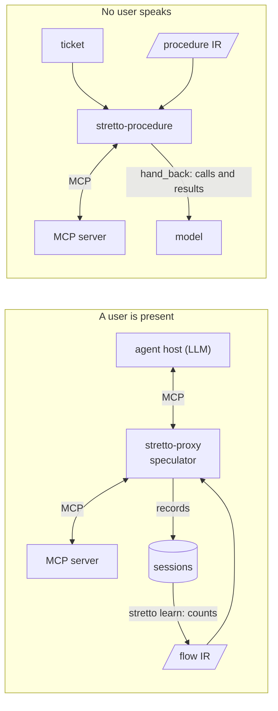

# Compile What the Environment Decides: Read-Only Speculation and Compiled Procedures for LLM Agents

*Draft, 2026-09-26. Placeholders marked* ⟨…⟩ *await runs in progress.*

## Abstract

An LLM agent pays a model turn for every decision, yet many of its decisions are fixed by what its tools returned, not by what the user said. We make this precise and use it in two regimes. While a user is present, a program learned from traces can take over only reads, speculatively. Because reads leave the state unchanged and stay current until the next write, the optimal speculator's decision separates over reads: make each read whose probability of use before the next write exceeds $\delta/(\beta+\delta)$, for a detour's cost $\delta$ and a saved turn's value $\beta$. That probability, not the next-step probability by which speculative-action systems rank, is the one to estimate. Counting the same contexts for this event estimates it with a calibration error of 0.01–0.08, against 0.06–0.16, and the costs can be counted in the same traces. Across nine frontier agents it never saw, the speculator takes 86% of retail's read-only ceiling in replay, 10 points more than the next-step speculator, and saves more tokens than it in every domain at that domain's costs. Live, with no model of its own, it cut GLM-5.3's LLM turns by 28% (95% CI 19–36%). Where no user speaks, a whole procedure, writes included, can be compiled once. On τ²-bench's solo telecom tasks, a procedure compiled from traces passes 35 of 40 held-out tasks with no model. A cascade that hands a model only what the procedure's own outcome check cannot confirm passes 39 of 40, at 0.48 LLM turns per ticket against 15.9 for the model alone. Both run in stretto, an MCP proxy and a procedure runtime. Learning is counting: ⟨learning-curve sentence⟩.

## 1 Introduction

Tool-using agents spend most of their cost in the LLM turns that decide the next call. Work that reuses traces to cut that cost either keeps the model in the loop (workflow memory [AWM], induced skills [ASI, SkillWeaver]) or compiles traces into programs that run without it [TraceCompiler, Compiled AI, PreAct]; work that speculates on the next action overlaps it with the model's own latency [Speculative Actions, Speculative Macro Commit]. Two questions sit under all of these: *which* of an agent's decisions a program learned from traces can take over at all, and *when* acting on a prediction pays.

We answer both with one distinction. Each decision of an agent is informed by the state the tools have returned (what is in the account, what the phone reports) and by what the user said (which order, which fault). A program learned from traces sees the first; the second needs language. A compiler can take the decisions the environment determines, and no more, and two regimes follow:

- **A user is present** (τ²-bench's retail, airline and dual-control telecom). Replies, and decisions the user's words trigger, stay with the model. What remains are reads whose arguments the tool state supplies. Reads are safe to make speculatively: they cannot change the state, and a wrong one costs a lookup.
- **No user speaks** (telecom's solo mode, where the agent operates the phone itself). Every branch follows a tool result, so the whole procedure, writes included, can be compiled once, and handed to a model only when the outcome the ticket states does not hold.

Contributions:

1. **What can be compiled, measured.** Every LLM turn of nine frontier agents on τ²-bench, classed by what decided it. A read-only speculator can save at most 29% of turns while a user is present, and reading the user's words would add less than a point (§4.1).
2. **The probability that matters.** Because reads commute with each other and with the state until the next write, the optimal speculator's decision separates over reads: make each read whose probability of use *before the next write* clears $\delta/(\beta+\delta)$, for a detour's cost $\delta$ and a saved turn's value $\beta$ (Proposition 3). That probability, not the next-step probability that speculative-action systems rank by, is estimated by counting the same contexts for a different event. It is calibrated where the next-step estimate is not, the threshold follows from costs counted in the same traces, and the speculator it drives takes 86% of retail's ceiling across nine agents it never saw, 10 points more than the next-step speculator, and cut a live agent's LLM turns by 28% with no model of its own (§4.2–4.4).
3. **Compile once where no user speaks.** A procedure compiled from traces passes 35 of 40 held-out solo telecom tasks with no model and hands back exactly what its own check of the ticket's outcome cannot confirm; with a model on those, the cascade passes 39 of 40 at 0.48 LLM turns per ticket, against 15.9 for the model alone (§4.5).

Both run in stretto: an MCP proxy that serves the speculator between any agent and any MCP server, and a runtime that executes a compiled procedure against one.

## 2 Model

### 2.1 Episodes, reads and writes

An episode is a sequence of LLM turns. In turn $k$ the agent emits either a message to the user or a set of calls $C_k$, each $c = (t, a)$ a tool $t$ with arguments $a$, whose results the environment returns before the next turn. Tools are *reads* $\mathcal R$, which leave the environment's state unchanged, or *writes* $\mathcal W$. We write $x_k$ for the *tool state* before turn $k$ (every call and result so far) and $w_k$ for the user's words so far.

A turn is *decided by the environment* when the agent's choice depends on $x_k$ alone: its policy satisfies $\pi(\cdot \mid x_k, w_k) = \pi(\cdot \mid x_k)$. A program learned from traces can represent such decisions and no others, since traces show it $x$ and, for the user's words, only their surface.

### 2.2 Speculation and its replay semantics

A *speculator* $\sigma$ maps a tool state to a set of reads with bound arguments, $\sigma(x) \subseteq \mathcal R$, which it makes after a tool response, before the agent's next turn, and whose results it appends to that response. A read made at time $s$ *answers* a later call $c$ of the agent at time $u > s$ if it is the same call and returned what $c$ would return at $u$; each read answers at most one call. With no write (the agent's or the user's) in $(s, u)$ it always does, since reads leave the state unchanged. A turn is *saved* when every call in it is answered; a read that answers no call is a *detour*.

**Proposition 1 (safety).** If $\sigma(x) \subseteq \mathcal R$ for all $x$, and the agent's calls are those it would make without $\sigma$ except that answered calls are omitted, then the environment's state after every write is the same with and without $\sigma$.

*Proof.* Reads do not change the state, so the speculator's reads do not. An answered call's result is, by the definition of answering, what the call would have returned itself. The writes, their order and the states they act on are therefore unchanged. ∎

So a speculator can change an episode's outcome only through the agent's context, never through the environment. Its worst case is a detour.

**Proposition 2 (ceiling).** A speculator whose arguments are bound from the tool state, and whose reads answer only calls with no write in between, saves at most the turns whose calls are all reads with every argument present in the tool state after a tool response since the last write.

We measure this ceiling on recorded episodes (§4.1). A read can also answer across a write that left its result unchanged, so a replay may save turns outside it: at least 1.5% of the turns the use-before-write speculator saves in §4.2 are, and 0.5% of the next-step speculator's.

### 2.3 The optimal speculator decomposes

At a decision point with state $x$, let $U(x)$ be the multiset of reads the agent would make, absent the speculator, before the next write, the agent's or the user's: the reads a lookup made now is sure to answer. For a candidate read $c$, answering one of the agent's calls is worth $\beta_c$ (the LLM turn it spares, and the call's tokens), and a detour costs $\delta_c$ (its result's tokens in every later turn's context, and the tool's own cost). We take these values to be additive over calls. That is exact when the agent makes one call per turn, as in 84% of the turns in the ceiling (§4.1); in a turn of parallel reads the turn is spared only when all are answered, so their values are complements, and the sum below is a first-order approximation.

**Proposition 3 (decomposition).** For a set $S$ of candidate reads, the expected utility is
$$\mathbb E\,u(S) = \sum_{c \in S} \big(q_c\,\beta_c - (1-q_c)\,\delta_c\big), \qquad q_c = \Pr\big(c \in U(x) \mid x\big),$$
and it is maximized by $S^\star = \{c : q_c \ge \delta_c / (\beta_c + \delta_c)\}$.

*Proof.* Reads commute with one another and with the state, so the result of $c$, and whether it can answer a call, do not depend on which other reads are in $S$; the utility is a sum over $S$ of terms that each depend on $c$ alone, and the expectation of a sum is the sum of expectations. Each term is non-negative exactly when $q_c \ge \delta_c/(\beta_c+\delta_c)$. ∎

Two consequences follow. First, the probability that matters is not that the agent calls $c$ *next* but that it calls $c$ at all before its next write, now or after a reply or other reads; since the next call is one of those, $q_c \ge \Pr(c \text{ next} \mid x)$, and a speculator that thresholds the next-step probability acts too rarely. Second, the threshold is a ratio of costs, not a tuning knob, and both costs can be counted. Live, a detour carried 2,530 input tokens over the rest of its episode and a saved turn saved 6,000, so $\theta^\star = \delta/(\beta+\delta) \approx 0.30$; counted in recorded episodes the same ratio comes out at 0.30 in retail and at 0.12–0.13 in airline and telecom, whose contexts are longer and whose results are shorter (§3).

The contrast with speculative decoding is the point. A drafted token is wasted when any token before it is rejected, because a sequence must match as a whole, so draft trees rank tokens by the product of confidences along their path [EAGLE-2, SpecDec++]. Reads form a set: each is used or not on its own, whenever the agent gets to it, and the path product is the wrong criterion.

### 2.4 Estimating the probability of use by counting

We factor a candidate read's probability of use into its tool and its arguments, $q_c \approx r(t \mid h)\,\rho(a \mid t, x)$, and estimate both from other agents' traces by conjugate updating.

**The tool.** Each step of an episode is abstracted to its tool, its outcome (returned, failed) and a feature of its result; $h$ is the sequence of abstract steps. The *habit* is a hierarchical Dirichlet back-off model of the next step over the last $j \le 2$ steps [MacKay & Peto 1995]:
$$p_j(t \mid h_j) = \frac{n(h_j, t) + \alpha\, p_{j-1}(t \mid h_{j-1})}{n(h_j) + \alpha}, \qquad p_{-1} \text{ uniform},$$
whose concentration $\alpha$ has a posterior we sample. It is the posterior predictive of a Dirichlet–multinomial at each context, with the shorter context as its prior mean. (As served, the habit has one more such layer, for an episode-level group; a flow learned without intents puts every session in one group, so the layer weighs the longest context's counts once more. That only sharpens the next-step estimate, which §4.2 finds too low, not too high.) The quantity Proposition 3 needs is not the next step but the event $t \in U$. We count it over the same contexts: $m(h_j, t)$ is the number of training steps after $h_j$ from which the agent called $t$ before its next write, and each tool is its own Beta–Bernoulli, backed off the same way,
$$r_j(t \mid h_j) = \frac{m(h_j, t) + \alpha\, r_{j-1}(t \mid h_{j-1})}{n(h_j) + \alpha}.$$
The $r_j(\cdot \mid h_j)$ need not sum to one: after a customer lookup, the agent reads the user and then an order before its next write. The same counts, a different event.

**The arguments.** For each argument of each read tool, the traces show where the agent took its value: the path of an earlier result, in the order the agent used such sources at this site. The binding takes the value at the first source that holds one. Its chance $\rho$ is the rate at which the agents passed that value in training, shrunk towards the site's rate $\bar\rho$ with a Beta prior of weight 2,
$$\rho = \frac{k + 2\bar\rho}{n + 2},$$
counted separately where the user had named another record of the list, and where the record the user described had already been read. These counts cover the case that dominates the errors: the right tool on the wrong record.

The speculator makes the reads that clear $\theta$ one at a time, each conditioned on those before it (Algorithm 1). Learning is counting: the model has no gradient-trained parameter, and runs as a probabilistic program [fugue] whose predictive is closed-form. We compare it with the rule it replaces, which takes the likeliest *next* tool and makes it when $p\,\rho \ge \theta$.

```text
Algorithm 1. The speculator, after each of the agent's tool responses.
  input: tool state x, abstract history h, threshold θ
  loop
    C ← { (t, a) : t a read, a = bind(t, x) defined }   # bind skips values an earlier call of t passed
    if C = ∅: stop
    (t*, a*) ← argmax over C of r(t | h) · ρ(a | t, x)
    if r(t* | h) · ρ(a* | t*, x) < θ: stop
    y ← call t*(a*); append (t*, a*, y) to the response; x ← x + (t*, a*, y); h ← h + abstract(t*, y)
```

### 2.5 Compile once where no user speaks

Where the environment decides every branch, we compile the policy itself. At each *site* (the tool that just returned, or the start), a decision tree over the tool state's features predicts the next call, as decision mining learns the branches of a process from its logs [Decision mining] (ID3, depth by cross-validation over tasks). Its actions are whole calls, whose identifiers are learned as *provenance*: the path of the result that held the value (with, in a list of records, the fields that set the chosen record apart), or the shape it had in the task's ticket. They are bound again at run time from that run's results. A guard forbids repeating a read before a write, or a write. The run stops when the tree says so, and then checks the ticket's stated outcome with a read. It hands the task to a model only when that check fails, with its calls and their results as the model's context: a *cascade*, in which, as in model cascades [Cascades], the expensive model sees only what a cheap check cannot confirm. The procedure is data, a file of trees, bindings and checks, which a small runtime executes against any MCP server.

### 2.6 The system

stretto implements both regimes for any agent and any MCP server. `stretto-proxy` sits between the agent's host and the server as a stdio MCP server, forwards every message, records sessions, and, after each of the agent's calls, runs the speculator: the lookups it makes ride in the same tool result, so the agent sees them with no new tool and no change to its prompt. The speculator is a file, the flow IR: the counts of §2.4, the lookups each site may make, and where each argument comes from. `stretto learn` writes it from recorded sessions, and since every estimate is a posterior predictive of conjugate counts, learning from another session adds its counts; the flow can be reviewed as a diff, shadowed, and promoted site by site. Its run after each call is a probabilistic program [fugue] whose three interpreters simulate it, execute it against the server, and score a recorded session under it. A compiled procedure is also a file, the procedure IR, and `stretto-procedure` runs it against a server and returns its calls and verdict. Nothing in either file is a model weight: a flow or a procedure is data a person can read.



*Figure 1. The two regimes in stretto. Left: the proxy forwards every message, records sessions, and after each of the agent's calls makes the lookups the flow decides on, inside the same tool result. Right: a compiled procedure runs with no model and hands a ticket to one only when its check of the stated outcome fails.*

## 3 Setup

**Tasks.** τ²-bench [Barres et al. 2025] has three customer-service domains with a simulated user: retail (114 tasks), airline (50) and telecom (114), where in telecom the user also operates a phone, and a solo mode of telecom in which the agent operates it and no user speaks. We use its train/test split (74/40, 30/20, 74/40) throughout: nothing is learned from a test task.

**Agents.** For replay, the recorded test episodes, four trials each, of the nine agents on τ²-bench's leaderboard with trajectories published in all three domains: GLM-5, Qwen3.5-397B, Qwen3-Max, GPT-5.2 at high and no reasoning, Claude Opus 4.5, Claude Sonnet 4.5, Gemini Pro and Gemini Flash. Speculators are learned from other agents: the training episodes of τ²-bench's four 2025 runs (Claude 3.7 Sonnet, GPT-4.1, GPT-4.1-mini, o4-mini), so every replay is of agents the speculator never saw. In solo telecom, the runs of GPT-4.1 and o4-mini, each under the written manual and the written workflow policy.

**Replay.** A replay re-executes each recorded episode's calls in order in τ²-bench's environment, with the speculator serving lookups after each call as it would live, and scores it by §2.2: a recorded call is skipped when a lookup answered it, a turn is saved when all its calls are, a lookup that answers none is a detour. A replay counts what the speculator would have spared an agent that otherwise acted as recorded (§6). Intervals are 95%, from a bootstrap over tasks, a task's four trials drawn together.

**Live.** GLM-5.3 runs in Claude Code with τ²-bench's system prompt and no built-in tools; τ²-bench's tools are served over MCP behind `stretto-proxy`, which records the session and runs the speculator. The user is GLM-5.3 prompted as τ²-bench's user simulator. Rewards are τ²-bench's own checks of the final database, and in solo telecom of the environment and the required actions.

**Costs.** A detour's cost $\delta$ and a saved turn's value $\beta$ are in input tokens. On the live paired run the flow's 17 detours carried 43,000 input tokens over the rest of their episodes, and its 260 saved turns saved 1.56M: $\beta \approx 6{,}000$, $\delta \approx 2{,}530$ and $\theta^\star = \delta/(\beta+\delta) \approx 0.30$. Both can also be counted from recorded episodes, in each agent's own input tokens: $\beta$ as the input tokens of a turn in the ceiling, plus its calls' tokens over the turns after it, and $\delta$ as a detour's result tokens times the turns left after the result that prompted it, over the detours a speculator makes in replay. Pooled over the eight agents whose episodes report tokens, retail's count gives $\beta = 5{,}820$ and $\delta = 2{,}470$, so $\theta^\star = 0.298$, what the live run measured. Airline's and telecom's contexts are longer and their detours shorter: $\theta^\star = 0.13$ ($\beta = 7{,}050$, $\delta = 1{,}020$) and $0.12$ ($8{,}930$ and $1{,}180$); solo telecom's is $0.06$. Utilities are at each domain's own costs.

An earlier version of our replay skipped any recorded call already made, the agent's own repeats included, and so counted as saved the 0.2–0.9% of turns (3.3% for one agent) in which an agent repeated calls it had made. The numbers here use the rule of §2.2.

## 4 Results

### 4.1 What decides an agent's turns

Over 39,298 LLM turns of nine agents' test episodes (§3), 46.8% reply to the user, 12.2% write and 41.0% only read (Table 1). A speculator that binds arguments from the tool state could have saved at most the reads whose every argument sits in an earlier result, after a tool response since the last write: 29.0% of all turns (retail 34.2%, airline 29.5%, telecom 24.7%), from 16% to 41% by agent and domain. Allowing an argument to be a value the user wrote raises the ceiling by 0.7 points. In 84% of the turns in the ceiling the agent made one call (78% in airline, 87% in telecom); the rest are parallel reads. The rest of the turns, seven in ten, stay with the model: they reply, write, or read what only the user's words can name.

*Table 1. LLM turns of nine agents' test episodes by what they do, and the read-only ceiling (Proposition 2). Pooled over agents, with the range across agents in brackets.*

| | Turns | Replies | Writes | Reads | Ceiling |
|---|---|---|---|---|---|
| Retail | 14,106 | 39.6% [34–44] | 14.0% [12–17] | 46.3% [42–53] | 34.2% [29–41] |
| Airline | 7,530 | 40.3% [29–54] | 12.7% [11–18] | 46.9% [35–60] | 29.5% [16–40] |
| Telecom | 17,662 | 55.2% [41–60] | 10.6% [8–12] | 34.3% [30–46] | 24.7% [17–38] |
| All | 39,298 | 46.8% | 12.2% | 41.0% | 29.0% |

### 4.2 Speculation in replay

**The next-step probability understates the probability of use.** Replays log every lookup a speculator weighed with whether the agent made that call before its next write. After a user's details, GLM-5 and Claude Sonnet 4.5 read an order *next* with probability 0.64 under the habit, but read it before their next write 94% of the time; after an order, a product comes next with probability 0.08, but before the next write 38% of the time, once the agent has told the user what the order holds. Over all lookups the share used ran far above the habit's score: 0.94 of lookups scored 0.4–0.5 were used, 0.97 of those scored 0.5–0.6, and 0.48 of those scored 0.05–0.10 (GLM-5, retail). Counting the right event (§2.4) lowers the calibration error and the Brier score in every domain, each interval excluding zero, and ranks lookups better everywhere but telecom, where the two rank alike (Table 2).

*Table 2. Calibration of the score $q = p\,\rho$ against use before the next write, over every lookup the speculators weighed in replay (nine agents; two in solo telecom): expected calibration error (10 bins), Brier score, and AUC, with 95% intervals for each difference from a bootstrap over tasks shared by both.*

| | Lookups weighed | ECE, next step → use before write | Brier | AUC |
|---|---|---|---|---|
| Retail | 20,673 / 21,175 | 0.164 → 0.083 [−0.098, −0.047] | 0.142 → 0.100 [−0.055, −0.029] | 0.929 → 0.950 [+0.006, +0.037] |
| Airline | 17,124 / 17,174 | 0.106 → 0.068 [−0.042, −0.029] | 0.104 → 0.092 [−0.015, −0.009] | 0.821 → 0.845 [+0.002, +0.047] |
| Telecom | 33,844 / 34,976 | 0.069 → 0.049 [−0.025, −0.011] | 0.073 → 0.062 [−0.013, −0.008] | 0.925 → 0.930 [−0.007, +0.017] |
| Telecom, solo | 32,291 / 32,029 | 0.056 → 0.014 [−0.050, −0.023] | 0.080 → 0.074 [−0.009, −0.002] | 0.763 → 0.818 [+0.036, +0.071] |


*Figure 2. Reliability of the two scores (bins of at least 100 lookups). The next-step score sits above the diagonal: lookups it rates 0.4–0.6 are used nine times in ten.*

**At the cost-derived threshold the right probability saves more.** Across a sweep of thresholds (Figure 3), the speculator on the probability of use traces a frontier of turns saved against detours that reaches beyond the next-step speculator's. Priced at each domain's counted costs, its utility peaks where $\theta^\star$ puts it in four of the six agent and domain pairs swept: at 0.3 in retail for both agents ($\theta^\star = 0.30$), and for Claude Sonnet 4.5 at 0.15 in airline and 0.1 in telecom ($\theta^\star = 0.13$ and 0.12). The other two peak at 0.4–0.5. GPT-5.2 without reasoning used 2% of the lookups scored 0.1–0.3 in telecom: scores counted on other agents overstate its use. GLM-5's lookups below 0.3 in airline were used about as often as scored, but seldom completed a turn (23 more uses and 4 more turns saved at 0.1 than at 0.3), the complements of §2.3. At its best threshold the use-before-write speculator's utility exceeds the next-step speculator's best by 10–14% in retail and in Sonnet's airline, by 2% in Sonnet's telecom and GLM-5's airline, and trails it by 9% for GPT-5.2 in telecom. It is also robust to the threshold: past its peak its utility falls slowly, where the next-step speculator's collapses beyond 0.4–0.5, since next-step scores seldom exceed one half. Over nine agents at $\theta = 0.3$ (Table 3), it takes 86.4% of retail's ceiling, against the next-step speculator's 76.2% (+10.2 points, 95% CI 6.7–14.2), for 0.16 more detours per episode: a net 1.6 thousand input tokens saved per episode (0.8–2.5). The gain holds for each of the nine agents, from 2.9 to 4.4 points of turns saved. In telecom it takes 3.8 more points of the ceiling for twice the detours, which telecom's costs make worth it: +0.60 thousand tokens per episode (0.30–0.91), where at retail's costs, with a detour twice as dear against a saved turn, the two would be even. In solo telecom it saves 1.7 thousand more (0.6–2.9), and in airline the two make nearly the same lookups (+0.10, 0.00–0.25).


*Figure 3. Utility against the threshold, in millions of the agent's input tokens at its domain's counted costs, on the test episodes of GLM-5 and Claude Sonnet 4.5 (retail, airline, telecom) and GPT-5.2 without reasoning (telecom), for speculators learned from the 2025 runs; the dashed line is the domain's $\theta^\star$. Every cell is in the round's published rows.*

*Table 3. Nine agents' test episodes at θ = 0.3, pooled per domain: LLM turns saved, detours per episode, share of the read-only ceiling, and utility per episode in thousands of input tokens at the domain's own costs (§3), with 95% intervals from a bootstrap over tasks shared by both speculators.*

| | Speculator | Turns saved | Detours per episode | Share of ceiling | Utility per episode |
|---|---|---|---|---|---|
| Retail | next step | 26.1% [24.0, 28.1] | 0.34 [0.23, 0.44] | 76.2% [71.7, 81.6] | 14.1 [12.6, 15.4] |
| | use before write | **29.6%** [27.2, 32.0] | 0.50 [0.36, 0.65] | **86.4%** [80.2, 93.1] | **15.6** [14.1, 17.2] |
| | difference | +3.5 [2.3, 4.9] | +0.16 [0.06, 0.29] | +10.2 [6.7, 14.2] | +1.6 [0.8, 2.5] |
| Airline | next step | 13.6% [10.4, 17.0] | 0.35 [0.22, 0.48] | 46.2% [38.3, 55.1] | 9.67 [7.37, 12.31] |
| | use before write | 13.7% [10.6, 17.2] | 0.35 [0.22, 0.48] | 46.6% [38.5, 55.4] | 9.77 [7.44, 12.39] |
| | difference | +0.1 [0.0, 0.3] | 0.00 | +0.5 [0.0, 1.1] | +0.10 [0.00, 0.25] |
| Telecom | next step | 11.8% [10.8, 12.9] | 0.31 [0.27, 0.35] | 47.9% [45.5, 50.3] | 12.6 [12.1, 13.1] |
| | use before write | 12.8% [11.6, 14.0] | 0.66 [0.56, 0.76] | 51.7% [49.0, 54.4] | **13.2** [12.6, 13.7] |
| | difference | +0.9 [0.7, 1.2] | +0.35 [0.27, 0.44] | +3.8 [2.7, 4.8] | +0.60 [0.30, 0.91] |
| Telecom, solo† | next step | 19.9% [18.4, 21.7] | 1.48 [1.27, 1.70] | 40.0% [36.9, 43.9] | 25.4 [23.7, 27.2] |
| | use before write | 21.3% [19.4, 23.5] | 1.70 [1.50, 1.92] | 42.8% [39.0, 47.0] | **27.2** [25.1, 29.3] |
| | difference | +1.4 [0.5, 2.3] | +0.22 [0.09, 0.34] | +2.8 [1.1, 4.6] | +1.72 [0.56, 2.88] |

† Two agents, GPT-4.1 and o4-mini, the only published solo runs; the speculator is learned from their own training episodes.

### 4.3 Learning from few sessions

⟨learning curves — running⟩

### 4.4 Live

Live, the speculator runs in `stretto-proxy` between the agent and the tools, over MCP: GLM-5.3 in Claude Code on τ²-bench's own prompts, with GLM-5.3 as the user. The earlier flow, which weighs the habit's next-step probability with an LLM's answers about the state [D0], cut LLM turns by 25.5% (95% CI 20.5–30.4%) over 80 paired retail and airline tasks, with 71 passed without it and 70 with it. The speculator of §2.4, deciding on the probability of use before the next write at $\theta = 0.3$, the live-measured $\theta^\star$, and asking no model, ran on 20 retail and 8 airline test tasks drawn at random from those 80, against the same recorded baseline (Table 4). It cut turns by 27.9% (19.1–35.9%) over the 28, where the earlier flow had cut 23.0% on the same tasks, and input tokens by 21.9% (9.9–32.9%); 23 of the 28 took fewer turns. The replay's assumption held throughout: of the speculator's 101 lookups, the agent made none again before the next write.

*Table 4. Live, GLM-5.3 as agent and user, against the paired run's recorded baseline (airline: the mean of its two trials; passes: its first). 95% intervals from a bootstrap over tasks.*

| | Tasks | LLM turns, baseline → speculator | Change | Passed: baseline, D0, speculator |
|---|---|---|---|---|
| Retail | 20 | 227 → 154 | −32.2% [−40.0, −23.5] | 17, 14, 16 |
| Airline | 8 | 83.5 → 70 | −16.2% [−37.2, +10.6] | 7, 7, 5 |
| Both | 28 | 310.5 → 224 | −27.9% [−35.9, −19.1] | 24, 21, 21 |

Five pairs disagree on the outcome: four passed only without the speculator and one only with it (McNemar $p = 0.38$). In all four, every lookup the speculator made returned what the baseline agent's own read had returned, and the episodes parted later: twice at the simulated user's choice (the reason given for a cancellation; two items changed instead of one), and twice at the agent's decision after a user's plea (an exception granted on a basic-economy booking, as the earlier flow's agent had also granted; another route searched, whose fare the user declined). Twenty-eight tasks cannot separate an effect of lookups on the agent's later decisions from the agent's own variance, and we claim neither; the 80 pairs bound the earlier flow's loss at 7.5 points.

### 4.5 Compiling where no user speaks

In telecom's solo mode the agent operates the phone itself, and every branch follows a tool result. The procedure compiled from the successful training episodes of four solo runs (GPT-4.1 and o4-mini, each under the written manual and the written workflow policy; 730 episodes of 74 tasks) passes 35 of the 40 held-out tasks with no model, where the agents it was compiled from pass 49–78% (Table 5). Its identifiers bind for customers no trace saw: renamed throughout the database it passes the same 35, and on another customer's account 35, where constants pass 16 and 19. Its own check of the ticket's stated outcome resolves 25 runs, transfers 11 to a person as the policy directs, and hands back 4, all four failures; it misses one failure, a run it judged resolved.

The cascade gives the handed-back tickets to a model, which takes over from the procedure's state with its calls and results as context. Live, with GLM-5.3 in Claude Code on τ²-bench's solo protocol, it resolved all four in both of two trials, in 4.75 LLM turns each. On the same four tickets from scratch it resolved three, in 12–19 turns, and on four other tickets three, in 14–21. The cascade passes 39 of 40 held-out tasks and makes 0.48 LLM turns per ticket, where GLM-5.3 alone made 15.9.

*Table 5. Telecom solo, 40 held-out tasks. LLM turns per ticket for the agents are their recorded averages; for GLM-5.3 alone, over the eight tickets run.*

| | Passed | LLM turns per ticket |
|---|---|---|
| Agents compiled from (4 runs, 4 trials) | 49–78% | 14.7–18.1 |
| GLM-5.3 alone (8 tickets) | 6 of 8 | 15.9 |
| Compiled procedure alone | 35 of 40 | 0 |
| Procedure, then GLM-5.3 on its 4 hand-backs (2 trials) | 39 of 40 | 0.48 |

The procedure is a file stretto runs: `stretto-procedure` executes it against any MCP server, and on all 40 held-out tasks it made exactly the calls of the reference implementation, with the same rewards and verdicts.

## 5 Related work

**Reusing traces with the model in the loop.** Workflow memory [AWM] and induced skills [ASI, WALT, SkillWeaver] give the agent text or callable routines mined from its own successes; they save 10–27% of steps on web tasks, and AWM's workflows offered as callable actions were used in 18.5% of tasks. They change what the model sees. We change neither the prompt nor the tool list: the speculator's reads arrive inside results the agent asked for.

**Compiling traces into programs.** Where a task recurs without branching, a compiled program removes the model almost entirely [LOOP, Compiled AI, PreAct]. TraceCompiler compiles multi-turn API traces into workflows with argument provenance, classes each binding as constant, user input, copy, transform or dynamic, and declines to compile an intent whose irreversible effect is under-determined; its authors report no rate at which intents compile. Robotic process mining reached the same condition for automating a step, that each parameter is computable from earlier ones [Bosco et al., Leno et al.]. Our §2.1 names the condition these systems share and measures it on every turn of nine agents: a step is compilable when the environment decides it, and a compiled program can take the environment-decided steps, which are the reads with copied arguments while a user is present (§4.1), and whole procedures where no user speaks (§4.5). Our hand-back is on the ticket's stated outcome, not on a mismatch mid-run [PreAct] or a missing branch [TraceCompiler].

**Speculating on the next action.** Speculative Actions predicts 22–38% of τ-bench retail API calls with a smaller model and restricts speculation to actions that can be undone; Speculative Macro Commit executes macros mined from τ² traces and verifies their first call, since a library match alone reproduced the next steps 34.6% of the time; AutoTool executes a predicted call when a transition graph and a parameter filler agree, and cuts LLM calls by 15–25%; AOSpec speculates on an action and on its observation together to hide serving latency. These systems rank candidates by the probability of the next action and verify sequences. Proposition 3 shows that for reads the right quantity is the probability of use before the next write, a first-passage probability that the next-step one understates (§4.2), and that the decision separates over reads, which lets a speculator act on each read alone. Speculative decoding [Leviathan et al., EAGLE-2, SpecDec++] ranks draft tokens by path products because a draft must match as a sequence; reads do not.

**Compiling the policy instead of the traces.** On τ²-bench the largest gains come from compiling the written policy into a graph with an LLM inside each node [STAGE, PolicyGuide], mostly in telecom, whose policy is a troubleshooting flowchart. Our solo-telecom workflow is compiled from traces alone and runs no model inside; the written procedure given to an LLM agent (τ²-bench's workflow policy) reaches 78% on the same tasks, the compiled procedure 88%, and the cascade 98% (§4.5).

**Counting.** The habit is MacKay and Peto's hierarchical Dirichlet language model over abstract steps; the reach estimator applies the same back-off to a Bernoulli event per read; bindings are Beta–binomial rates. All updates are conjugate, so learning from a new session is adding its counts (§4.3).

## 6 Limitations

**One benchmark.** Every number is on τ²-bench, whose three domains were built for coverage rather than sampled from traffic; a deployment with a heavy head of common requests should compile more, and one with a long tail less.

**Replay assumes the agent skips what it already has.** The replay counts a call as answered when a lookup made earlier returned the same result, and assumes the agent, seeing that result, does not make the call and otherwise acts as recorded. Live, GLM-5.3 made none of the speculator's 101 lookups again before the next write; other agents, in other harnesses, are untested.

**Costs are averages, in tokens.** θ* prices a domain's average detour against its average saved turn, in input tokens. A detour early in a long episode costs more than one late in it, prompt caching and output prices change the exchange rate, and latency is another currency. A threshold per decision, from the result's size and the turns left, is the natural refinement, and both are countable.

**Pass rates are underpowered.** The live runs bound turns, not success: a pass-rate interval of one point would need thousands of paired tasks. We report the pairs that disagree and why.

**Where no user speaks is τ²-bench's own variant.** The compiled procedure was fitted on 730 successful episodes of one customer's base tasks, carried to renamed and moved customers, and hands back what its own check cannot confirm; its one missed failure shows that the check is only as good as the outcome the ticket states. Procedures need many consistent demonstrations: fitted on a quarter of the training tasks it passed 18 of 40. A compiled procedure is cloned behavior, whose errors compound once a run leaves the states its demonstrators visited [DAgger]; the outcome check bounds what that costs, by handing such runs back.

**Simulated users.** τ²-bench's users are LLMs, and so are the users of our live runs.

## References

- [τ²-bench] V. Barrès, H. Dong, S. Ray, X. Si, K. Narasimhan. *τ²-Bench: Evaluating Conversational Agents in a Dual-Control Environment.* 2025. arXiv:2506.07982.
- [AWM] Z. Z. Wang, J. Mao, D. Fried, G. Neubig. *Agent Workflow Memory.* ICML 2025. arXiv:2409.07429.
- [ASI] Z. Z. Wang, A. Gandhi, G. Neubig, D. Fried. *Inducing Programmatic Skills for Agentic Tasks.* 2025. arXiv:2504.06821.
- [SkillWeaver] B. Zheng et al. *SkillWeaver: Web Agents Can Self-Improve by Discovering and Honing Skills.* 2025. arXiv:2504.07079.
- [WALT] *WALT.* 2025. arXiv:2510.01524.
- [TraceCompiler] S. El Yadouni, G. Li. *TraceCompiler: Skill-Guided Mining and Compilation of LLM Agent Traces into Mostly Deterministic Workflows.* 2026. arXiv:2608.02680.
- [LOOP] arXiv:2605.14237. [Compiled AI] arXiv:2604.05150. [PreAct] arXiv:2606.17929. Replay and compilation without a model, 2026.
- [Bosco et al.] A. Bosco, A. Augusto, M. Dumas, M. La Rosa, G. Fortino. *Discovering Automatable Routines from User Interaction Logs.* BPM Forum 2019. [Leno et al.] V. Leno et al. arXiv:2106.13446.
- [Speculative Actions] N. Ye et al. *Speculative Actions: A Lossless Framework for Faster AI Agents.* ICLR 2026. arXiv:2510.04371.
- [Speculative Macro Commit] Z. Liu, S. Kundu, P. A. Beerel. *Speculative Macro Commit for Faster Tool-Using Agents.* MLSP 2026. arXiv:2609.03236.
- [AutoTool] J. Jia, Q. Li. *AutoTool: Efficient Tool Selection for Large Language Model Agents.* AAAI 2026. arXiv:2511.14650.
- [AOSpec] H. M. Chen, J. Guo, W. Luk, H. Fan. *AOSpec: Action and Observation Co-Speculation for Low-Latency Agent Serving.* 2026. arXiv:2608.00881.
- [Leviathan et al.] Y. Leviathan, M. Kalman, Y. Matias. *Fast Inference from Transformers via Speculative Decoding.* ICML 2023. arXiv:2211.17192.
- [EAGLE-2] Y. Li, F. Wei, C. Zhang, H. Zhang. *EAGLE-2: Faster Inference of Language Models with Dynamic Draft Trees.* EMNLP 2024. arXiv:2406.16858. [SpecDec++] K. Huang, X. Guo, M. Wang. *SpecDec++: Boosting Speculative Decoding via Adaptive Candidate Lengths.* 2024. arXiv:2405.19715.
- [STAGE] arXiv:2608.22538. [PolicyGuide] arXiv:2608.19861. Compiled policies on τ²-bench, 2026.
- [MacKay & Peto] D. J. C. MacKay, L. C. B. Peto. *A Hierarchical Dirichlet Language Model.* Natural Language Engineering 1(3), 1995.
- [Decision mining] A. Rozinat, W. M. P. van der Aalst. *Decision Mining in ProM.* BPM 2006.
- [DAgger] S. Ross, G. Gordon, D. Bagnell. *A Reduction of Imitation Learning and Structured Prediction to No-Regret Online Learning.* AISTATS 2011.
- [Cascades] L. Chen, M. Zaharia, J. Zou. *FrugalGPT.* 2023. arXiv:2305.05176. A. Madaan et al. *AutoMix: Automatically Mixing Language Models.* NeurIPS 2024. arXiv:2310.12963.
- [fugue] A. Nodeland. *fugue: a monadic probabilistic programming library for Rust.* https://github.com/alexnodeland/fugue.
- [D0] stretto's earlier read-only flow, with an LLM arbiter: RFC-001 §3.13–3.22, https://github.com/alexnodeland/stretto.
