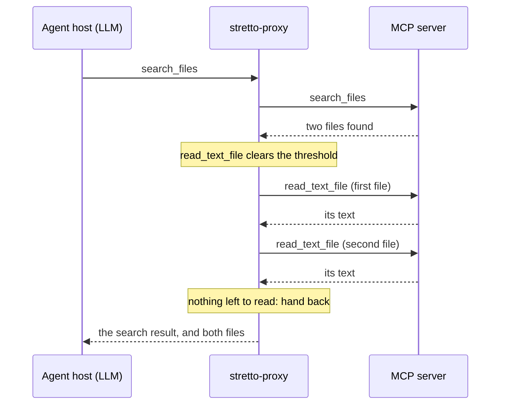

# How it works

<!-- BRAND SLOT: the animated explainer (website/public/explainer/index.html). Renders nothing until the file is there. -->
<BrandEmbed kind="explainer" />

stretto sits where MCP already puts a server: between the agent's host and the server. The host starts `stretto-proxy` as if it were the server, and the proxy starts the real one. Everything the two send each other passes through the proxy unchanged, except for one thing: when the proxy serves a flow, it adds the results of the lookups the flow made to the result of the agent's call.

## One call, step by step

1. The agent calls a tool. The proxy forwards the call and holds the server's response.
2. The flow looks at the call that just returned and decides whether to make a lookup. If one clears the threshold, the proxy makes it itself, as a request with an id of its own (`stretto-<n>`), and the flow decides again after it.
3. When no lookup clears the threshold, or a cap is reached (`--flow-per-call`, 8 lookups by default, and `--flow-per-session`, 40), the flow *hands back*.
4. The agent gets its own result with one more text item: each lookup, its arguments and its result, under `--- Also looked up automatically (current results; no need to repeat these calls) ---`.

The agent reads the lookups in the result it asked for. When they answer the calls it was about to make, it skips those turns.

## How a flow decides

A flow is learned from recorded sessions, by counting ([flows](./concepts/flows)). After each call it weighs every read it may make there. For each, it needs two numbers:

- **the tool's probability**: with the `reach` decider, the chance that the agent calls this tool before its next write, counted over the same short histories in training ([deciders](./concepts/deciders));
- **the binding's chance**: the chance that the arguments the flow would pass are the agent's own, from where those values came from in training: which earlier result, at which JSON path ([bindings](./concepts/bindings)).

It takes the read with the highest product, if the product is at least the threshold (0.3 by default), makes it, and decides again with the new result in hand. A read whose arguments cannot be bound, such as a value only the user knows, is never made.

The paper states this as its Algorithm 1, and shows why the threshold is a ratio of costs, $\theta^\star = \delta/(\beta+\delta)$: a detour's cost against a saved turn's value ([§2.3–2.4](/research/paper#23-the-optimal-speculator-decomposes)).

## Why a wrong guess is cheap

A flow only makes reads: it calls only tools it learned as lookups and that the server does not mark as writes, and `--flow-tools` can narrow that to a list. A read leaves the state of the environment unchanged, so everything the agent then writes acts on the same state as without the flow. A lookup the agent did not need, a *detour*, costs its result's tokens in the agent's context and the tool's own cost, and nothing else. See [lookups and detours](./concepts/lookups).

## The loop around it

<HowItWorks />

Recording never stops: the proxy logs sessions whether or not it serves a flow. So the sessions a flow serves are new training data, and learning again is cheap. `stretto flow-diff` then says whether the new flow can do anything the old one could not, and exits with 1 if so, which fits a pull request ([audit and review](./concepts/audit-and-review)).

A new flow can start in [shadow mode](./concepts/shadow-and-promotion): it decides and logs what it would look up, but makes nothing, and `stretto promote` then keeps it to the sites where its lookups were the agent's own.

## Where no user speaks

Some work has no user in the loop: a ticket comes in, and the agent works through a procedure against the tools. There every branch follows a tool result, so a whole procedure, writes included, can be compiled once from traces and run with no model. `stretto-procedure` runs one, checks the outcome the ticket states, and hands back to a model only what that check cannot confirm. See [procedures](./concepts/procedures).

<!-- BRAND SLOT: the launch video (website/public/media/launch.mp4, poster media/launch-poster.png). Renders nothing until the file is there. -->
<BrandEmbed kind="launch" caption="stretto in two minutes." />
